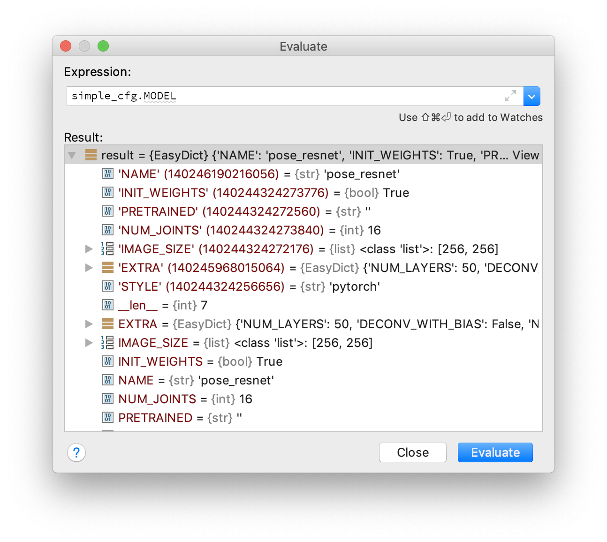

 # Questions.md

- [ ] 改了一些参数，在某些视频上能够提升 mAP， 其他的没有效果。那么我是不是需要从整体来看效果（跑整个数据集）？只在小的 set 上实验可能错过在全部数据集上有效的参数。
- [ ] 影响 mAP 的因素太多，怎么判定是哪里出问题了？


## 2018-12-21

终极目标：回到70.6。什么因素会导致变化，1box2est。box 看起来差不多为什么会得出迥异的 est？

61.6版本（最垃圾的）和70.6版本的区别在于，有相同的 unified box，但是不一样的 estimation 结果。

63.6的会少一些estimation，但是 box 不变？

总结：三个人的 box 都一样。问题来了，你 joint 不一样，怎么会有相同的 box 呢？

两种可能，现在的 box 导致70.6的结果，或者61.6的结果。使用现在的box 来 estimation 一下？

```
全部的，为了备份谁是谁

pred_json-pre-commissioning/valid_task_-1_DETbox_allBox_propAll_propGT_tfIoU_nmsThres_0.05_0.5-70.6

# gt frames  : 2607 # pred frames: 2607
& Head & Shou & Elb  & Wri  & Hip  & Knee & Ankl & Total\\
& 80.7 & 79.4 & 71.6 & 59.9 & 71.1 & 66.6 & 59.5 & 70.6 \\


--predictions=pred_json-debug/valid_task_-1_DETbox_allBox_propAll_propGT_tfIoU_nmsThres_0.05_0.50/ --evalPoseEstimation
# gt frames  : 2607 # pred frames: 2607
& Head & Shou & Elb  & Wri  & Hip  & Knee & Ankl & Total\\
& 71.7 & 71.2 & 62.5 & 51.0 & 62.1 & 57.7 & 50.6 & 61.7 \\
```


先专注验证一下342

```
70.6
[OUT] - Pkl saved. Evaluate box AP unifed_boxes-pre-commissioning/valid_task_-1_DETbox_allBox_propAll_propGT_tfIoU_nmsThres_0.05_0.5
[OUT] - In total 413 predictions, 96 gts.
[OUT] - AP: 0.5487

# gt frames  : 48 # pred frames: 48
& Head & Shou & Elb  & Wri  & Hip  & Knee & Ankl & Total\\
& 39.8 & 39.2 & 19.4 & 14.9 & 35.3 & 23.1 & 12.9 & 27.3 \\


61.6
[OUT] - Pkl saved. Evaluate box AP unifed_boxes-debug/valid_task_-1_DETbox_allBox_propAll_propGT_tfIoU_nmsThres_0.05_0.50
[OUT] - In total 416 predictions, 96 gts.
[OUT] - AP: 0.5489

# gt frames  : 48 # pred frames: 48
& Head & Shou & Elb  & Wri  & Hip  & Knee & Ankl & Total\\
& 50.4 & 54.3 & 25.4 & 19.5 & 28.8 & 52.2 & 29.8 & 38.1 \\
```

wait 让我们先分个支，因为这个居然可以提高这么多（gt 是45.2）。

使用70.6的 unifiedbox，看能不能达到效果。

```
pred_json-debug/valid_task_1_DETbox_allBox_tfIoU_nmsThres_0.05_0.50/000342_mpii_relpath_5sec_testsub.json
& Head & Shou & Elb  & Wri  & Hip  & Knee & Ankl & Total\\
& 39.8 & 39.2 & 19.5 & 14.9 & 35.3 & 23.2 & 12.9 & 27.3 \\
没毛病
```

然后是61.6的 box。

一样。

但是 box 明明有区别的？？说明这个 box 的区别并不大。现在来跑一个新的，只用两个的 unified box

70.6的前六

```
& Head & Shou & Elb  & Wri  & Hip  & Knee & Ankl & Total\\
& 82.8 & 77.8 & 62.4 & 42.6 & 66.6 & 49.2 & 36.2 & 61.2 \\
```

61.6的前六。

```
& Head & Shou & Elb  & Wri  & Hip  & Knee & Ankl & Total\\
& 82.2 & 77.6 & 62.4 & 42.6 & 66.6 & 49.2 & 36.2 & 61.1 \\
```

那么只要把前六弄成一样就好。来看下前六的区别。


的确就是box 差异。具体为什么会有 box 的差异？

用61.6的 unified box 跑出来的结果，并没有差很多。换句话说，box其实差得很小，最后的 est 结果也理应差得很小。

```
& Head & Shou & Elb  & Wri  & Hip  & Knee & Ankl & Total\\
& 80.5 & 79.3 & 71.4 & 59.8 & 71.1 & 66.5 & 59.5 & 70.5 \\
```


第一个是用run with cfg t-flow-debug跑出来的。第二个用第一个的 unified box 当做gtbox 跑出来的；第三个是之前的 baseline。

```
import  os,torch
first='000342_mpii_relpath_5sec_testsub.pkl'
p6='unifed_boxes-debug/61.7-valid_task_-1_DETbox_allBox_propAll_propGT_tfIoU_nmsThres_0.05_0.50'
p75='unifed_boxes-debug/70.5-valid_task_1_DETbox_allBox_tfIoU_nmsThres_0.05_0.50'
c6=torch.load(os.path.join(p6,first))
c75=torch.load(os.path.join(p75,first))

for l in range(len(c6)):
    for k,v in c6[l].items():
        print(c6[l][k]==c75[l][k])

```

通过以上的代码可以验证70.5和61.7里两个 unifiedbox 完全一样。

思路：跟踪70.5的 task 1和61.7的 task-1两个的 joint-est 过程。

于是发现了不同之处。同一张图，同一个 bb，居然 scale 不一样？上面是61.7的。


由于 scale 的计算是：`center, scale = box2cs(bb, self.img_ratio)`，那肯定只有 `img_ratio`的问题了。

| | 70.5 |  61.7     |
| ---- | ---- | ---- |
| image_ratio | .75 | 1 |

于是来看 image_ratio 的计算，是`self.img_ratio = simple_cfg.MODEL.IMAGE_SIZE[0] / simple_cfg.MODEL.IMAGE_SIZE[1]`。61.7使用的设定完全就不对！上图是61，下图是70。


所以其实这个也因为线程的复制而重新载入了。可是为什么呢？我在主线程的哪里修改了 simple 呢？我选择从头开始看 simple cfg 的变化。

原来如此，主线程里调用了`load_simple_model`，此刻就把主线程里的 simple cfg 给修改了。

| 修改前                                                       | 修改后                                                       |
| ------------------------------------------------------------ | ------------------------------------------------------------ |
|  |  |

所以还需要把 simple_cfg 给传到 FrameItem里面去。

DEbug 完毕。


