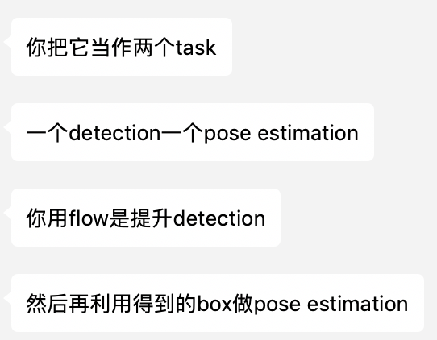
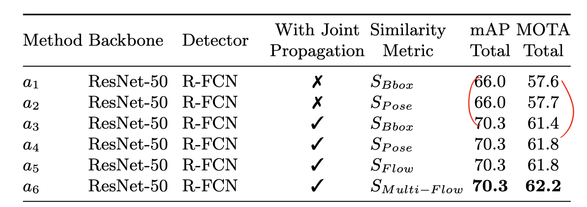
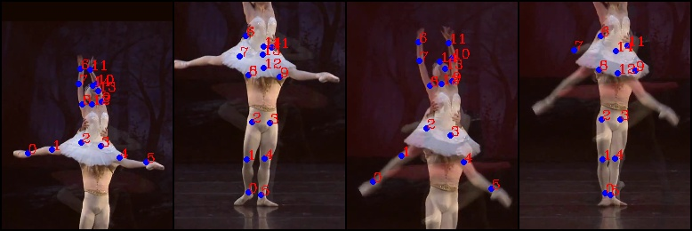
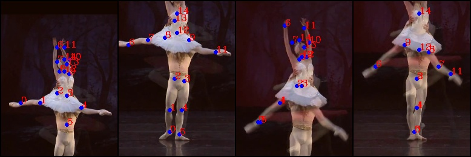

nise-embedding

Milestones

- 2018-12-06: Surpass the state-of-the-art result of task 1, single frame multi-person pose estimation, in PoseTrack 2017. [link](#2018-12-06).
- 2018-12-12: Surpassthe state-of-the-art result  (my own) of task 1,  [2018-12-12](#2018-12-12).

# TODOLIST

+ [x] 接口问题
+ [x] 固定 gt 的 bbox，est joints（2018-12-03）
+ [ ] ~~找到 single frame 的问题，查看输出的图像。~~
+ [x] 2018-12-06：joint 最终分数=human detection*joint
+ [ ] 训练之前 freeze 一下
+ [x] flow 用 pad 达到 32的倍数
    + [ ] （其他的方式）
+ [ ] joint prop 的 score 怎么确？
    + [ ] 单纯使用上一帧过来的 score
    + [x] 上一帧的 score*joint 的 score
+ [ ] 达到pt17 task 3 的state-of-the-art
+ [x] 使用data parallel 加速，现在太慢了。
    + [ ] detect可以parallel？好像不行。
    + [ ] flow可以？flow 的 model 可以接受 batch 的输入，大小为 $bs\times channels\times 2\times h\times w$。但如果要这一步并行化，就要加载进所有的图片？或者也可以设置一个生成 flow 的 batchsize， 毕竟这个是 root。$2$指的是 flow 需要两张图片，如果要并行就需要$[[1,2],[2,3],[3,4]]$。
+ [x] 宁可花多一点时间去做正确，也不要回头来 debug。
+ [x] 为什么高那么多？66.7->69.6。[2018-12-12](2018-12-12)。
+ [ ] flow 的正确性怎么看？小数据集的正确性先确保了。
+ [x] 多线程。bash 多个 GPU 利用。
+ [x] 参数与设定分开。[2018-12-12](2018-12-12)。
+ [x] 存储 detection 结果
+ [x] 存储 flow 结果

# experiment

Single-frame pose estimation training log. 

The person is cropped using gt, and the  accuracy is calculated according to single person.

person detector: [Detectron](https://github.com/roytseng-tw/Detectron.pytorch#supported-network-modules), config `my_e2e_mask_rcnn_X-101-64x4d-FPN_1x`, which has the highest boxes AP in the general fasterRCNN/Mask RCNN family. The modification is only to turn off mask. 

```
$ diff my_e2e_mask_rcnn_X-101-64x4d-FPN_1x.yaml ../Detectron.pytorch/tron_configs/baselines/e2e_mask_rcnn_X-101-64x4d-FPN_1x.yaml
5c5
<   MASK_ON: False # turn off mask
---
>   MASK_ON: True
```


## 2018-12-17

讨论结果

- 做一个控制变量的实验，要做到底

今天要做的事情

- 存储flow的结果，以及在detection结果上的estimation数据。用处是flow debug
- 弄清楚box ap怎么计算
- 做实验的时候目的和步骤写清楚，记下来。
- 保持每天目的记录的习惯，而不是想什么做什么。

重新实现了在 unify box 的时候使用的 nms，先用 thres1过滤掉低分 box， 再用普通 nms 的手法。

首先在15302上做实验

```
新 baseline，甚至比原来的 nms 提高了(原来61.8)
valid_task_1_DETbox_allBox_propAll_propDET_nmsThres_0.05_0.5
# gt frames  : 50 # pred frames: 50
& Head & Shou & Elb  & Wri  & Hip  & Knee & Ankl & Total\\
& 72.0 & 71.3 & 53.4 & 52.4 & 63.4 & 65.7 & 58.4 & 63.0 \\
使用了 flow 的结果
valid_task_2_DETbox_allBox_propAll_propDET_nmsThres_0.05_0.5
& 73.1 & 72.0 & 53.9 & 53.6 & 64.3 & 66.4 & 59.2 & 63.9 \\
```

然后是前六

```
新 baseline(原来是60.5)
& 55.0 & 50.2 & 44.7 & 33.8 & 40.7 & 33.0 & 24.8 & 41.3 \\
flow 结果(稍微有一点点提高)
& 55.1 & 50.2 & 44.8 & 33.4 & 40.5 & 33.3 & 25.0 & 41.3 \\
```

然后是20880

```
新(原来是56)
& 67.4 & 56.7 & 42.9 & 35.3 & 54.5 & 42.7 & 37.8 & 49.5 \\
flow
& 69.0 & 57.6 & 43.6 & 36.2 & 55.8 & 44.7 & 39.0 & 50.7 \\

```

15860

```
新(原来69.2)
& 85.2 & 75.9 & 61.2 & 48.8 & 71.9 & 62.4 & 61.1 & 67.9 \\
flow
& 84.4 & 75.5 & 61.4 & 49.7 & 69.3 & 58.7 & 56.3 & 66.3 \\

```


## 2018-12-16

on 20880


```
baseline
76.6	65	45.1	40	63.5	49.9	41.6	56
DETbox_allBox_propALLGT_gtScore_0.9_propFiltered_propThres_0.5_propGT
# gt frames  : 59 # pred frames: 59
& Head & Shou & Elb  & Wri  & Hip  & Knee & Ankl & Total\\
& 77.0 & 64.5 & 47.2 & 40.7 & 63.1 & 49.2 & 42.0 & 56.3 \\

DETbox_allBox_propFiltered_propThres_0.5_propGT/ --evalPoseEstimation
# gt frames  : 59 # pred frames: 59
& Head & Shou & Elb  & Wri  & Hip  & Knee & Ankl & Total\\
& 76.8 & 64.7 & 44.3 & 40.8 & 66.2 & 51.2 & 40.2 & 56.4 \\

DETbox_allBox_propFiltered_propThres_0.5_propDET/ --evalPoseEstimation
# gt frames  : 59 # pred frames: 59
& Head & Shou & Elb  & Wri  & Hip  & Knee & Ankl & Total\\
& 69.9 & 60.0 & 42.8 & 38.2 & 63.3 & 52.2 & 45.0 & 54.2 \\
```


## 2018-12-15

先记录一下，使用 gtbox 的 estimation 结果，这个标志着使用 detector 和其他辅助方式来增加 box 的极限。

```
& Head & Shou & Elb  & Wri  & Hip  & Knee & Ankl & Total\\
& 85.8 & 82.3 & 73.8 & 62.6 & 73.4 & 69.5 & 64.5 & 74.0 \\
```

还是在 debug flow 的环节。从图像上，flow能够生成一些 box，并且 box 生成的也很准确（如果使用的 gtpose），可以断定确实补充了某些 box。但是这些box 究竟有没有用到最终的joint estimation， 就要看 nms 的结果。

以下实验记录了，在15302的视频里，如果用上一帧全部 gtbox 的 flow 会怎么样。这些 gtbox 的 score 分别取用了不同的值。

现在我生成flow 的逻辑是:

- if use all gt pos
    + use all
- elif prev frame has joints
    - if filter
        - filter 
    - else
        - use all prev joints
    - if prev frame has gt pose and if we want use gt pose
        - use gt pose, which has box IoU > 0.5 with filtered prev joint box.
    - else
        - use filtered prev joint and its box
    - prop

```
baseline 不加 flow
& Head & Shou & Elb  & Wri  & Hip  & Knee & Ankl & Total\\
& 67.8 & 69.4 & 51.7 & 50.4 & 64.0 & 66.2 & 60.0 & 61.8 \\
Score_1
& Head & Shou & Elb  & Wri  & Hip  & Knee & Ankl & Total\\
& 68.9 & 67.9 & 53.0 & 53.7 & 61.0 & 63.0 & 58.9 & 61.5 \\
Score_0.9
& Head & Shou & Elb  & Wri  & Hip  & Knee & Ankl & Total\\
& 68.4 & 69.5 & 52.4 & 51.5 & 64.6 & 66.3 & 60.4 & 62.3 \\
Score_0.7
& Head & Shou & Elb  & Wri  & Hip  & Knee & Ankl & Total\\
& 68.7 & 70.0 & 52.5 & 51.6 & 64.8 & 66.7 & 60.8 & 62.6 \\
Score_0.5
& Head & Shou & Elb  & Wri  & Hip  & Knee & Ankl & Total\\
& 68.7 & 70.1 & 52.5 & 51.7 & 64.9 & 66.9 & 60.8 & 62.7 \\
0.3
& Head & Shou & Elb  & Wri  & Hip  & Knee & Ankl & Total\\
& 68.7 & 70.1 & 52.5 & 51.8 & 64.9 & 66.9 & 60.8 & 62.7 \\
0.1
& Head & Shou & Elb  & Wri  & Hip  & Knee & Ankl & Total\\
& 68.7 & 70.2 & 52.5 & 51.8 & 64.9 & 66.9 & 60.7 & 62.7 \\
```

以下是9883

```
baseline
& Head & Shou & Elb  & Wri  & Hip  & Knee & Ankl & Total\\
& 82.5 & 80.3 & 74.7 & 65.3 & 62.6 & 60.4 & 47.3 & 68.6 \\
score 1
& Head & Shou & Elb  & Wri  & Hip  & Knee & Ankl & Total\\
& 73.1 & 72.4 & 70.3 & 58.4 & 61.5 & 69.1 & 47.8 & 65.2 \\
score 0.9
& Head & Shou & Elb  & Wri  & Hip  & Knee & Ankl & Total\\
& 80.8 & 77.5 & 72.8 & 65.5 & 59.6 & 63.1 & 47.0 & 67.5 \\
.7
& Head & Shou & Elb  & Wri  & Hip  & Knee & Ankl & Total\\
& 81.4 & 78.7 & 73.8 & 65.3 & 59.7 & 63.1 & 47.1 & 68.0 \\
.5
& Head & Shou & Elb  & Wri  & Hip  & Knee & Ankl & Total\\
& 81.6 & 79.1 & 74.0 & 65.4 & 59.8 & 63.2 & 47.1 & 68.1 \\
.3
& Head & Shou & Elb  & Wri  & Hip  & Knee & Ankl & Total\\
& 81.8 & 79.6 & 74.3 & 65.5 & 59.9 & 63.2 & 47.1 & 68.3 \\
.1
& Head & Shou & Elb  & Wri  & Hip  & Knee & Ankl & Total\\
& 82.0 & 80.0 & 74.4 & 65.6 & 59.8 & 63.2 & 47.2 & 68.4 \\
```

前六个

```
baseline - 不用 flow(task 1)
& Head & Shou & Elb  & Wri  & Hip  & Knee & Ankl & Total\\
& 82.3 & 77.3 & 61.6 & 42.6 & 63.6 & 48.4 & 36.4 & 60.5 \\
1
& Head & Shou & Elb  & Wri  & Hip  & Knee & Ankl & Total\\
& 78.1 & 74.9 & 58.6 & 39.9 & 63.2 & 46.1 & 32.7 & 57.7 \\
.9
& Head & Shou & Elb  & Wri  & Hip  & Knee & Ankl & Total\\
& 82.0 & 77.8 & 62.0 & 42.9 & 64.0 & 48.5 & 36.1 & 60.6 \\
.7
& 82.1 & 77.9 & 62.0 & 42.9 & 64.0 & 48.5 & 36.1 & 60.6 \\
0.5
& 82.1 & 77.9 & 62.0 & 42.9 & 64.0 & 48.5 & 36.1 & 60.6 \\
```


## 2018-12-14

总结一下昨天学习的东西。做一个东西，本质是为了解决某个问题。为了解决这个问题，会提出一个方法。那么怎么看这个方法究竟有没有用，其实就是看这个问题有没有解决或者解决到了什么程度，**这就需要一个评判标准（ evaluation metric）/观察到什么现象**。另外，为了确保确实是这个方法的功效，还需要控制变量。

例如做这个项目

| pipeline       | 功能                         | evaluation  |
| -------------- | ---------------------------- | ----------- |
| 检测人         | top down 的方法基础          | box 的 AP   |
| 单人检测 joint | 在检测人的基础上，检测 joint | mAP         |
| flow prop      | 补充没有检测到的 box         | 无          |
| matching       | Assign tracking 的 id        | mota 和 mAP |
|                |                              |             |

现在想要知道 flow 有没有加对，问题就在于怎么决定是否有效。

- 用GT使用的上一帧的 gt 而非这一帧，只是用上一帧的 pose（probability=1），所以应该用 detector 的probability。 score 改一改。gt 和 pose 的 probability 可以联合起来。
- 专门看 detection 丢掉的视频。

可以tune 的参数

- nms 判定为同一个的 thres。


现在跑 task1，全部视频不要画图只需要半个小时，画图要一个小时。

继续加快，存储了 detection 的结果，

### 今天的实验

使用上一帧的 gtpose 做 prop 的 candidate，匹配对象是上一帧的，采用的方法是匈牙利匹配，score 是 iou。probability 使用的上一帧 detection 的 score。

```
3943
prev
84.4	92.3	85.7	52.8	85.8	80.3	77.4	80.1
after
& Head & Shou & Elb  & Wri  & Hip  & Knee & Ankl & Total\\
& 76.1 & 88.9 & 84.7 & 50.9 & 78.1 & 74.8 & 70.7 & 74.9 \\
```


### 有丢失bbox 的例子（六七十的 mAP）

- '3943'

- '9833'

- '22430'

- '15302'【人也很多】


    以下都是用 gtpose，第一排是不加flow（task1的结果）
    
    ```
    22430_mpii_relpath_5sec_testsub
    task1
    & Head & Shou & Elb  & Wri  & Hip  & Knee & Ankl & Total\\
    & 68.7 & 68.2 & 66.5 & 60.3 & 70.4 & 77.3 & 72.9 & 69.2 \\
    0.95
    & Head & Shou & Elb  & Wri  & Hip  & Knee & Ankl & Total\\
    & 47.6 & 49.8 & 50.0 & 53.5 & 63.2 & 72.2 & 70.0 & 57.4 \\
    0.999
    & Head & Shou & Elb  & Wri  & Hip  & Knee & Ankl & Total\\
    & 56.1 & 58.3 & 58.5 & 55.6 & 67.5 & 71.9 & 69.3 & 62.1 \\
    0.7
    & Head & Shou & Elb  & Wri  & Hip  & Knee & Ankl & Total\\
    & 47.5 & 49.6 & 50.6 & 53.0 & 63.4 & 72.2 & 70.0 & 57.3 \\
    0.5
    & Head & Shou & Elb  & Wri  & Hip  & Knee & Ankl & Total\\
    & 49.6 & 50.9 & 51.3 & 53.0 & 65.4 & 74.3 & 70.0 & 58.6 \\
    ```
    
    ```
    03943_mpii_step2_relpath_5sec_testsub
    & Head & Shou & Elb  & Wri  & Hip  & Knee & Ankl & Total\\
    & 84.4 & 92.3 & 85.7 & 52.8 & 85.8 & 80.3 & 77.4 & 80.1 \\
    0.95
    & Head & Shou & Elb  & Wri  & Hip  & Knee & Ankl & Total\\
    & 77.1 & 89.1 & 84.7 & 54.1 & 78.9 & 77.6 & 72.4 & 76.3 \\
    0.999
    & Head & Shou & Elb  & Wri  & Hip  & Knee & Ankl & Total\\
    & 81.4 & 91.2 & 85.5 & 55.0 & 81.3 & 77.9 & 72.8 & 78.1 \\
    ```
    
    ```
    09883_mpii_step2_relpath_5sec_testsub
    & Head & Shou & Elb  & Wri  & Hip  & Knee & Ankl & Total\\
    & 82.5 & 80.3 & 74.7 & 65.3 & 62.6 & 60.4 & 47.3 & 68.6 \\
    0.95
    & Head & Shou & Elb  & Wri  & Hip  & Knee & Ankl & Total\\
    & 75.5 & 75.4 & 73.9 & 59.4 & 63.3 & 69.9 & 47.9 & 67.1 \\
    0.999
    & Head & Shou & Elb  & Wri  & Hip  & Knee & Ankl & Total\\
    & 80.0 & 77.3 & 75.0 & 63.0 & 59.4 & 71.8 & 47.8 & 68.6 \\
    ```
    
    ```
    015302_mpii_relpath_5sec_testsub
    & Head & Shou & Elb  & Wri  & Hip  & Knee & Ankl & Total\\
    & 67.8 & 69.4 & 51.7 & 50.4 & 64.0 & 66.2 & 60.0 & 61.8 \\
    0.95
    & Head & Shou & Elb  & Wri  & Hip  & Knee & Ankl & Total\\
    & 69.4 & 68.8 & 53.0 & 53.3 & 61.5 & 63.6 & 58.9 & 61.8 \\
    0.999
    & Head & Shou & Elb  & Wri  & Hip  & Knee & Ankl & Total\\
    & 68.3 & 68.8 & 53.5 & 53.4 & 62.6 & 64.3 & 59.1 & 61.9 \\
    0.7
    & Head & Shou & Elb  & Wri  & Hip  & Knee & Ankl & Total\\
    & 69.2 & 68.7 & 53.0 & 53.1 & 61.6 & 64.0 & 59.3 & 61.8 \\
    0.5
    & Head & Shou & Elb  & Wri  & Hip  & Knee & Ankl & Total\\
    & 68.9 & 68.5 & 52.8 & 52.7 & 61.5 & 63.9 & 59.3 & 61.6 \\
    
    ```
    
    接下来是非 prop gt，使用检测出来的 joint
    
    ```
    22430_mpii_relpath_5sec_testsub
    task1
    & Head & Shou & Elb  & Wri  & Hip  & Knee & Ankl & Total\\
    & 68.7 & 68.2 & 66.5 & 60.3 & 70.4 & 77.3 & 72.9 & 69.2 \\
    0.95
    & Head & Shou & Elb  & Wri  & Hip  & Knee & Ankl & Total\\
    & 40.2 & 41.8 & 39.0 & 44.2 & 50.0 & 60.2 & 50.9 & 46.2 \\
    0.999
    & Head & Shou & Elb  & Wri  & Hip  & Knee & Ankl & Total\\
    & 48.9 & 49.5 & 45.5 & 47.9 & 52.8 & 60.4 & 51.6 & 50.8 \\
    ```
    
    ```
    015302_mpii_relpath_5sec_testsub
    task 1
    & Head & Shou & Elb  & Wri  & Hip  & Knee & Ankl & Total\\
    & 67.8 & 69.4 & 51.7 & 50.4 & 64.0 & 66.2 & 60.0 & 61.8 \\
    0.95
    & Head & Shou & Elb  & Wri  & Hip  & Knee & Ankl & Total\
    & 66.3 & 64.4 & 50.0 & 52.1 & 62.6 & 65.7 & 59.7 & 60.5 \
    0.999
    & Head & Shou & Elb  & Wri  & Hip  & Knee & Ankl & Total\
    & 67.7 & 67.5 & 52.0 & 52.4 & 64.6 & 66.7 & 60.2 & 62.0 \
    使用 gt 的 detection 的结果，自己去 estimation
    & Head & Shou & Elb  & Wri  & Hip  & Knee & Ankl & Total\\
    & 80.0 & 75.5 & 58.5 & 58.8 & 66.3 & 69.0 & 64.6 & 68.4 \\
    ```
    
    ```
    09883_mpii_step2_relpath_5sec_testsub
    & Head & Shou & Elb  & Wri  & Hip  & Knee & Ankl & Total\\
    & 82.5 & 80.3 & 74.7 & 65.3 & 62.6 & 60.4 & 47.3 & 68.6 \\
    0.95
    & Head & Shou & Elb  & Wri  & Hip  & Knee & Ankl & Total\\
    & 59.2 & 60.3 & 60.8 & 54.8 & 44.2 & 65.6 & 46.2 & 56.1 \\
    0.999
    & Head & Shou & Elb  & Wri  & Hip  & Knee & Ankl & Total\\
    & 81.9 & 80.1 & 74.9 & 64.8 & 55.0 & 72.0 & 47.5 & 69.0 \\
    ```


    ### 人太多的例子（六七十的 mAP）
    
    - 12834
    - 13293【50.9】
    - 
    
    ### 数据集的其他要点
    
    15860里面，有镜头切换，所以 flow 提取的全是 false positive。其实只有一小部分，因为已经在标注的 central sequence 之外了


## 2018-12-13

在prop 的时候加入是否使用 gtbox 的选项：如果True，在 prop 的时候，将上一帧的 box 和 gt 比较，如果有 gtbox 的 IoU 大于 thres，那么将这个 gtbox 对应的 gtjoint 拿过来prop， 而不是用上一帧 prop 的结果。这样既保留了detection的结果，又保证了 joint 的正确性。

验证实现结果：使用 thres==1

这是 task1的结果

```
groundTruth='val_gt_task1/', outputDir='./out', predictions='valid_anno_json_pred_task_1/', saveEvalPerSequence=False)
Loading data
# gt frames  : 333
# pred frames: 333
& Head & Shou & Elb  & Wri  & Hip  & Knee & Ankl & Total\\
& 82.3 & 77.3 & 61.6 & 42.6 & 63.6 & 48.4 & 36.4 & 60.5 \\
```
prop的时候使用 detect的结果（理应和上面一样）
```
valid_task_2_DETbox_propfiltered_propthres_1_propDET
& Head & Shou & Elb  & Wri  & Hip  & Knee & Ankl & Total\\
& 82.3 & 77.3 & 61.6 & 42.6 & 63.6 & 48.4 & 36.4 & 60.5 \\
```

prop 的时候使用 GT 的结果（理应一样）

```
valid_task_2_DETbox_propfiltered_propthres_1_propGT
& Head & Shou & Elb  & Wri  & Hip  & Knee & Ankl & Total\\
& 82.3 & 77.3 & 61.6 & 42.6 & 63.6 & 48.4 & 36.4 & 60.5 \\
```

好的正确了。接下来看 thres+GT 的结果

```
thres=0.5
& Head & Shou & Elb  & Wri  & Hip  & Knee & Ankl & Total\\
& 79.4 & 76.2 & 61.0 & 40.4 & 63.1 & 47.3 & 33.0 & 58.7 \\
0.9
& Head & Shou & Elb  & Wri  & Hip  & Knee & Ankl & Total\\
& 79.3 & 76.2 & 60.9 & 40.4 & 63.1 & 47.2 & 32.9 & 58.6 \\
0.99
& Head & Shou & Elb  & Wri  & Hip  & Knee & Ankl & Total\\
& 82.3 & 77.3 & 61.6 & 42.7 & 63.7 & 48.5 & 36.2 & 60.5 \\
```


## 2018-12-12

config 开始制作。

思路：直接使用 py 作为配置文件。现在有三个东西，一是`nise_lib/nise_config`，二是命令行里的`args`，三是这个`配置文件`。

定义优先度： args>py>nise\_cfg。但似乎可以融合——args 和 py。唯一传入 args 的是py 文件的路径。

我对param 和 cfg 的区别： param 没有默认值，cfg 有。所以 param 用来命名 LOG 等输出的文件。

DONE。

为了找出为什么奇奇怪怪莫名其妙就增加了mAP， 重新 debug。


找到了原因，之前使用了`1024x576`大小的，现在用的原图大小。

| 原来的              | 现在的       |
| ------------------- | ------------ |
| 读入一帧图片        | 读入一帧图片 |
| resize 到`1024x576` | 检测人       |
| 检测人              | estimation   |
| estimation          |              |

```
但是跑了原来的1024，mAP 又是……
& Head & Shou & Elb  & Wri  & Hip  & Knee & Ankl & Total\\
& 79.5 & 77.8 & 69.8 & 58.0 & 69.6 & 64.9 & 57.4 & 68.9 \\
```


放出之前的前六

```
& Head & Shou & Elb  & Wri  & Hip  & Knee & Ankl & Total\\
& 82.6 & 76.7 & 60.2 & 40.8 & 63.3 & 47.9 & 35.8 & 59.8 \\
```

开启了 prop

```
& Head & Shou & Elb  & Wri  & Hip  & Knee & Ankl & Total\\
& 82.3 & 77.3 & 61.6 & 42.6 & 63.6 & 48.4 & 36.4 & 60.5 \\
```

不开 prop

```
& Head & Shou & Elb  & Wri  & Hip  & Knee & Ankl & Total\\
& 82.3 & 77.3 & 61.6 & 42.6 & 63.6 & 48.4 & 36.4 & 60.5 \\
```


全部的不开 prop

```
& Head & Shou & Elb  & Wri  & Hip  & Knee & Ankl & Total\\
& 79.8 & 78.5 & 70.7 & 59.2 & 70.1 & 65.5 & 58.3 & 69.6 \\
```

也就是说回不去了？


## 2018-12-11

debug flow 中。

只打印 flow 的box 不够 debug， 还需要什么吗？我想要检测 prop 出来 box 

- [ ] 是否实现正确。打印原来的 joint， 新的 joint，新的 box，如何？
- [ ] 是否能够 nms 除去

### 加入了16662的 prop

16662的现象：因为本身人物比较清晰，prop 出来更多的是 false positive。现在想多做实验看是不是 fp 太多的问题，用提高 thres 来减少 prop。

prop 不筛

```
& Head & Shou & Elb  & Wri  & Hip  & Knee & Ankl & Total\\
& 14.2 & 15.8 & 11.7 &  7.6 & 13.4 &  8.3 &  7.2 & 11.4 \\
```

prop 时候用0.5筛掉

```
& Head & Shou & Elb  & Wri  & Hip  & Knee & Ankl & Total\\
& 27.3 & 34.0 & 25.5 & 18.7 & 26.0 & 25.3 & 25.7 & 26.1 \\
```

prop-0.9

```
& Head & Shou & Elb  & Wri  & Hip  & Knee & Ankl & Total\\
& 24.9 & 32.9 & 22.9 & 14.8 & 22.2 & 20.2 & 18.9 & 22.6 \\
```

prop 1-怎么比本身还高了？

```
& Head & Shou & Elb  & Wri  & Hip  & Knee & Ankl & Total\\
& 70.3 & 79.7 & 56.9 & 48.2 & 56.9 & 67.5 & 50.6 & 62.0 \\
```

et1

```
& Head & Shou & Elb  & Wri  & Hip  & Knee & Ankl & Total\\
& 82.3 & 77.3 & 61.6 & 42.6 & 63.6 & 48.4 & 36.4 & 60.5 \\
```

原因找到了：task1用的是`unified_bbox`，而 task2用的是`id_bboxes`，因为`id_bboxes`相当于 filter（以 humanthres） 过后的结果，所以可能 tp 和 fp 都减小了。


现在将 id 改成 unified，因为此时根本不要过滤。

et1（新跑的，怎么又上去了？）但至少和 prop1一样了。

```
& Head & Shou & Elb  & Wri  & Hip  & Knee & Ankl & Total\\
& 69.2 & 82.3 & 60.4 & 51.0 & 61.7 & 76.6 & 52.4 & 65.1 \\
```

prop 1-怎么又比本身还高了？

```
& Head & Shou & Elb  & Wri  & Hip  & Knee & Ankl & Total\\
& 69.2 & 82.3 & 60.4 & 51.0 & 61.7 & 76.6 & 52.4 & 65.1 \\
```

prop-0.9

```
& Head & Shou & Elb  & Wri  & Hip  & Knee & Ankl & Total\\
& 67.9 & 76.7 & 54.3 & 50.3 & 59.5 & 70.2 & 45.3 & 61.1 \\
```

prop 0.5

```
& Head & Shou & Elb  & Wri  & Hip  & Knee & Ankl & Total\\
& 67.2 & 75.8 & 53.7 & 49.6 & 59.2 & 70.6 & 45.6 & 60.7 \\
```

prop 0

```
& Head & Shou & Elb  & Wri  & Hip  & Knee & Ankl & Total\\
& 66.7 & 75.3 & 53.5 & 49.2 & 58.6 & 69.8 & 44.5 & 60.1 \\
```


### 前六个

et1和2018-12-10一样

prop thres=1，和 et1一样。很好。

```
& Head & Shou & Elb  & Wri  & Hip  & Knee & Ankl & Total\\
& 82.3 & 77.3 & 61.6 & 42.6 & 63.6 & 48.4 & 36.4 & 60.5 \\
```

### 全部的

task 1& propthres=1

```
& Head & Shou & Elb  & Wri  & Hip  & Knee & Ankl & Total\\
& 79.8 & 78.5 & 70.7 & 59.2 & 70.1 & 65.5 & 58.3 & 69.6 \\
```

0.9

```
& Head & Shou & Elb  & Wri  & Hip  & Knee & Ankl & Total\\
& 71.0 & 70.5 & 63.4 & 53.3 & 63.8 & 60.7 & 53.5 & 62.9 \\
```

propthres=0.5

```
& Head & Shou & Elb  & Wri  & Hip  & Knee & Ankl & Total\\
& 71.0 & 70.5 & 63.4 & 53.3 & 63.8 & 60.7 & 53.5 & 62.9 \\
```


## 2018-12-10

分段进行debug（如果有bug）

- [x] 打印flow的joint和box
- [ ] 我觉得flow出来的box分数不应该直接用原生的。这样的话，如果一个错误的box分数很高，再也没有方法把他去除掉。它就会一直被prop下去。




这个关系到我对过滤的理解。我一开始觉得 detection 和 prop 等价，但实际上还是应该想 prop 只是用来补足 detection 的不足。detection 如果过滤了，fp 和 tp 都可能减少；但是 prop 补足的应该只能是那些概率高的。

【task 1 - 前六】如果 detect 之后立马 filter 并且在 prop 的时候 filter

```
& Head & Shou & Elb  & Wri  & Hip  & Knee & Ankl & Total\\
& 85.3 & 79.8 & 64.0 & 44.6 & 65.3 & 50.1 & 37.8 & 62.6 \\
```

如果只在 detect 时候 filter（task-1）

```
& Head & Shou & Elb  & Wri  & Hip  & Knee & Ankl & Total\\
& 82.3 & 77.3 & 61.6 & 42.6 & 63.6 & 48.4 & 36.4 & 60.5 \\
```

只在prop 的时候过滤

```
& Head & Shou & Elb  & Wri  & Hip  & Knee & Ankl & Total\\
& 82.3 & 77.3 & 61.6 & 42.6 & 63.6 & 48.4 & 36.4 & 60.5 \\
```

如果都不开

```
& Head & Shou & Elb  & Wri  & Hip  & Knee & Ankl & Total\\
& 82.3 & 77.3 & 61.6 & 42.6 & 63.6 & 48.4 & 36.4 & 60.5 \\
```

没用？

而且不是吧为什么就成了60.5，之前还是59.8（在12-6），哪里改了？

## 2018-12-06

Debug：之前 predict joint 的时候有误。从formulation来说应该是
$$
P(Joint,Box|Image)=P(Box|Image)\cdot P(Joint|Box)
$$
而我用的只是$P(Joint|Box)$项，前面没用，所以百分比差了很多（大概是这个原因）。用前六个进行小测试，比[这里](#不使用 gtbox)高了7.7。

```
& Head & Shou & Elb  & Wri  & Hip  & Knee & Ankl & Total\\
& 82.6 & 76.7 & 60.2 & 40.8 & 63.3 & 47.9 & 35.8 & 59.8 \\
```

全部的

```
& Head & Shou & Elb  & Wri  & Hip  & Knee & Ankl & Total\\
& 75.8 & 75.1 & 67.7 & 56.0 & 67.9 & 63.6 & 55.9 & 66.7 \\
```

比论文里高了0.7。



此时的 mota 数据，虽然毫无参考性。

```
& MOTA & MOTA & MOTA & MOTA & MOTA & MOTA & MOTA & MOTA & MOTP & Prec & Rec  \\
& Head & Shou & Elb  & Wri  & Hip  & Knee & Ankl & Total& Total& Total& Total\\
&-108.2 &-100.2 &-164.7 &-191.7 &-128.3 &-160.1 &-214.3 &-149.5 & 83.1 & 26.8 & 83.6 \\
```

### 使用flow的思路

由于flow的model需要宽和高都是64的倍数，之前使用的是resize到一个固定大小，不知道有没有效果。现在改为在右侧和下册pad 0，计算完flow之后只取原图大小的部分。原因在于joint的位置只可能在原图坐标范围内。

现在的bug：joint prop的box会有很多有负数坐标。

```JSON
[-8.7352e+08, -9.2051e+08],
[-4.0187e+08, -9.2051e+08],
[-2.3431e+08,  5.2548e+08],
[-5.8184e+08,  4.2619e+08],
[-8.9214e+08, -8.6465e+08],
[-8.7973e+08, -8.7706e+08],
[-9.0455e+08, -8.5224e+08],
[-9.2317e+08, -9.2051e+08],
[-9.2317e+08, -8.9568e+08],
[-9.2317e+08, -8.9568e+08],
[ 2.6345e+07, -5.5436e+08],
[-9.4799e+08, -9.2051e+08],
[-8.5490e+08, -8.6465e+08],
[-9.2317e+08, -9.2051e+08],
[-1.5983e+08, -7.5295e+08]
```

原因不明，可能是因为flow太奇怪了？

不是，是因为有的box其实prob不高也拿去predict了，挨着边缘而joint预测的结果在圈外，所以joint就会负数，那么prop的时候其实有问题。之前没有意识到这个，因为tensor可以用负数索引。

解决。

## 2018-12-04

### 看gtbox的图

| No.   | phenomenon                                                   | which module's prob? |
| ----- | ------------------------------------------------------------ | -------------------- |
| 05833 | 舞蹈，两个人重合。一个人的joint赋值到了另一个上面            | joint est            |
|       | 镜头渐变的残影                                               | joint est            |
|       | gt
pred
 |                      |
| 14102 | 蹦极，两个人人贴在一起                                       |                      |
|       | 镜头从上往下看，人的透视                                     |                      |
|       | 人太小                                                       |                      |
|       |                                                              |                      |


## 2018-12-03


参数记录：

### 不使用 gtbox

nms 有两个 thres，1-先 filter 掉低 score 的-0.05，2-两个实例的相似程度-0.3。这是 detectron 的原版参数。

flow网络的 input 参数使用（1024，576）。必须是32的倍数。现在还没用到这个，还在 task1 阶段。


human threshold 改变的实验，使用一小部分的 validation set（前六个）

```
0.9
& Head & Shou & Elb  & Wri  & Hip  & Knee & Ankl & Total\\
& 68.5 & 65.3 & 53.1 & 37.3 & 59.6 & 44.3 & 28.7 & 52.1 \\
0.95
& Head & Shou & Elb  & Wri  & Hip  & Knee & Ankl & Total\\
& 68.5 & 65.3 & 53.1 & 37.3 & 59.6 & 44.3 & 28.7 & 52.1 \
```

使用了更高的准确度的模型
| Arch | Head | Shoulder | Elbow | Wrist | Hip | Knee | Ankle | Mean | Mean@0.1 |
|---|---|---|---|---|---|---|---|---|---|
| 256x192_pose_resnet_50_d256d256d256 | 93.179 | 92.590 | 88.054 | 82.101 | 87.774 | 84.567 | 79.706 | 87.921 | 29.291 |

```
20-87.92
& Head & Shou & Elb  & Wri  & Hip  & Knee & Ankl & Total\\
& 68.1 & 68.6 & 62.0 & 50.8 & 61.9 & 58.9 & 51.3 & 60.8 \\
```


### 使用 gtbox

ablation：不同的准确度的模型

```
经典19
& Head & Shou & Elb  & Wri  & Hip  & Knee & Ankl & Total\\
& 87.6 & 79.6 & 65.0 & 45.6 & 74.8 & 56.9 & 44.9 & 66.4 \\
20-87.92
& Head & Shou & Elb  & Wri  & Hip  & Knee & Ankl & Total\\
& 86.9 & 80.8 & 65.3 & 46.2 & 73.3 & 55.8 & 43.5 & 66.0 \\
```

反而变菜了。试试全部的——变强了0.6%。

```
20-87.92
& Head & Shou & Elb  & Wri  & Hip  & Knee & Ankl & Total\\
& 85.8 & 82.3 & 73.8 & 62.6 & 73.4 & 69.5 & 64.5 & 74.0 \\
```


## 2018-12-01

纠正了 joint 的 score 的问题

```
经典19
# gt frames  : 2607
# pred frames: 2607
Evaluation of per-frame multi-person pose estimation
saving results to ./out/total_AP_metrics.json
Average Precision (AP) metric:
& Head & Shou & Elb  & Wri  & Hip  & Knee & Ankl & Total\\
& 85.5 & 81.8 & 73.6 & 62.1 & 72.9 & 69.1 & 64.5 & 73.6 \\
```

## 2018-11-29

解决2018-11-28的问题，重新计算了 center 和 scale，用gtbbox的话:

```
For task 1
('# gt frames  :', 66558)
('# pred frames:', 66558)
Evaluation of per-frame multi-person pose estimation
('saving results to', './out/total_AP_metrics.json')
Average Precision (AP) metric:
& Head & Shou & Elb  & Wri  & Hip  & Knee & Ankl & Total\\
& 67.8 & 63.4 & 48.2 & 36.0 & 54.8 & 44.2 & 37.1 & 51.4 \\
```

新的问题出现了，就算input的大小、图像和单人关节预测一样，但是结果不一样？

[val_2565_pred](assets/val_2565_pred-1543543057015.jpg)

94-gt


94-pred


multi的时候如下。可以看到predict的0和5重合了，而上面的0是在左脚（虽然说也错了）.


+ [x] detection evaluation
+ [x] pose evaluation(pckh)
+ [x] thres 不同 就是 mean ap 
+ [x] joint 的 score


##    2018-11-28

005067。以下是第一张图对被遮蔽的三人进行est的结果，似乎人的box拉长了就无法est。


对应的single person情况是（以下是gt/predictation成对）


为什么single 要优质一些？是因为box好一些吗？去看box。