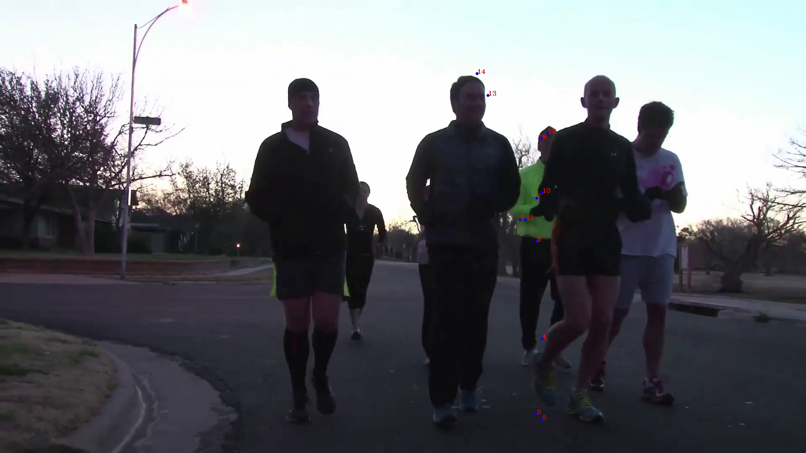
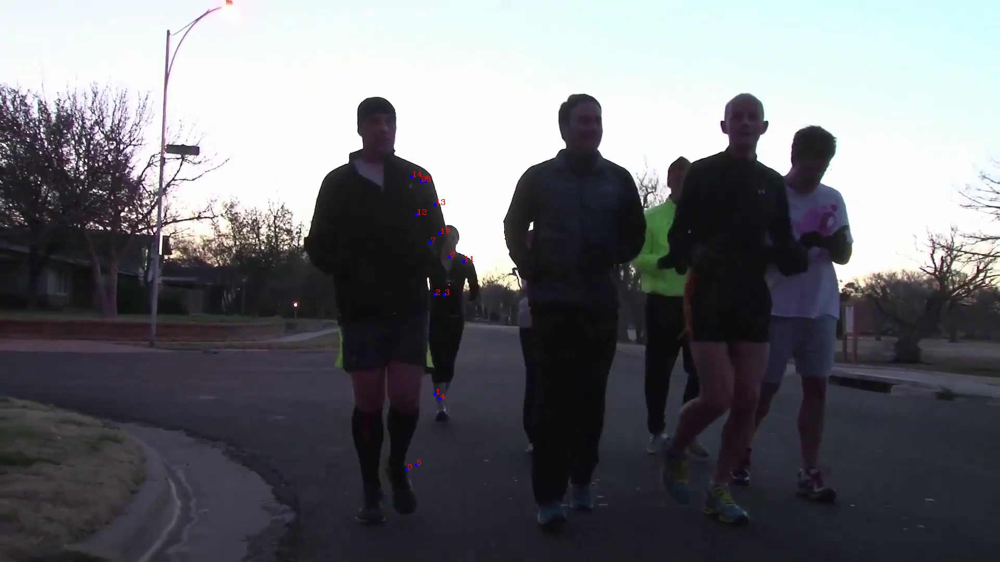
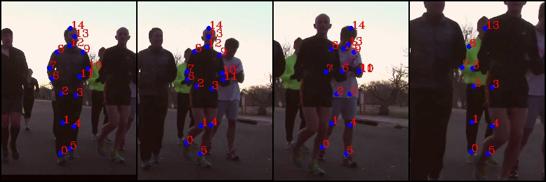
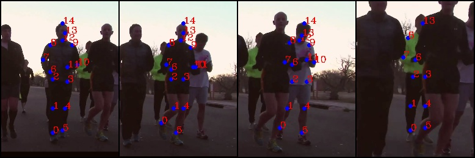
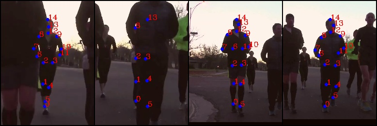
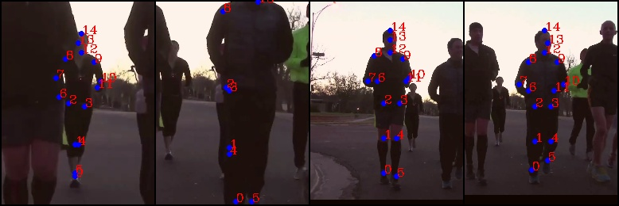
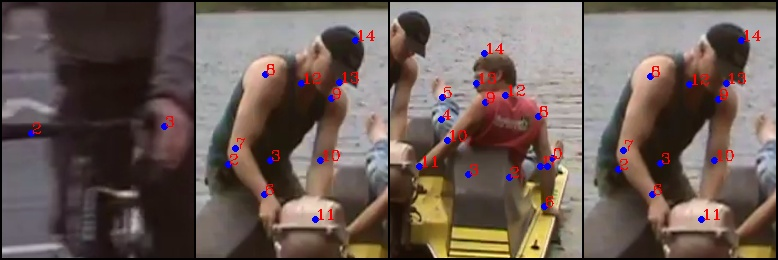
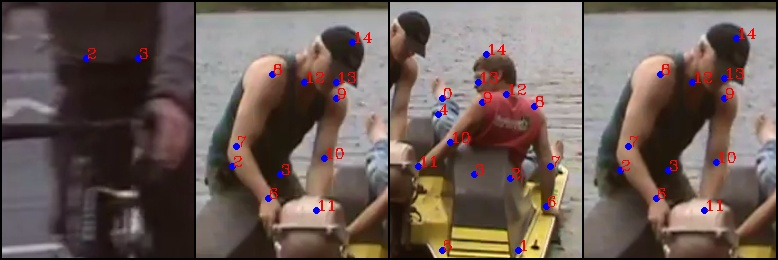
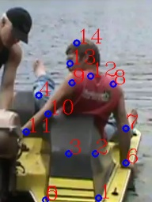

# nise-embedding


# experiment

Single-frame pose estimation training log. 

The person is cropped using gt, and the  accuracy is calculated according to single person.

```
Epoch 0
2018-11-21 19:31:30,988 | Arch | Head | Shoulder | Elbow | Wrist | Hip | Knee | Ankle | Mean | Mean@0.1 |
2018-11-21 19:31:30,988 |---|---|---|---|---|---|---|---|---|---|
2018-11-21 19:31:30,988 | 256x192_pose_resnet_50_d256d256d256 | 83.295 | 91.002 | 85.800 | 79.028 | 85.300 | 82.029 | 77.540 | 84.642 | 22.017 |
........
Epoch 5
2018-11-21 21:16:21,459 | Arch | Head | Shoulder | Elbow | Wrist | Hip | Knee | Ankle | Mean | Mean@0.1 |
2018-11-21 21:16:21,459 |---|---|---|---|---|---|---|---|---|---|
2018-11-21 21:16:21,459 | 256x192_pose_resnet_50_d256d256d256 | 92.736 | 91.836 | 86.993 | 80.692 | 86.890 | 83.286 | 78.440 | 86.942 | 29.620 |
......
Epoch 15
2018-11-21 23:25:31,966 | Arch | Head | Shoulder | Elbow | Wrist | Hip | Knee | Ankle | Mean | Mean@0.1 |
2018-11-21 23:25:31,966 |---|---|---|---|---|---|---|---|---|---|
2018-11-21 23:25:31,967 | 256x192_pose_resnet_50_d256d256d256 | 92.961 | 92.084 | 87.142 | 80.501 | 86.502 | 83.242 | 78.967 | 87.027 | 30.438 |
Epoch 16
2018-11-21 23:40:34,888 | Arch | Head | Shoulder | Elbow | Wrist | Hip | Knee | Ankle | Mean | Mean@0.1 |
2018-11-21 23:40:34,888 |---|---|---|---|---|---|---|---|---|---|
2018-11-21 23:40:34,888 | 256x192_pose_resnet_50_d256d256d256 | 92.980 | 92.075 | 87.071 | 80.674 | 86.626 | 83.462 | 79.078 | 87.109 | 30.494 |
Epoch 17
2018-11-21 23:55:28,076 | Arch | Head | Shoulder | Elbow | Wrist | Hip | Knee | Ankle | Mean | Mean@0.1 |
2018-11-21 23:55:28,077 |---|---|---|---|---|---|---|---|---|---|
2018-11-21 23:55:28,077 | 256x192_pose_resnet_50_d256d256d256 | 92.974 | 92.185 | 87.184 | 80.624 | 86.569 | 83.400 | 78.928 | 87.106 | 30.567 |
Epoch 18
2018-11-22 00:11:41,637 | Arch | Head | Shoulder | Elbow | Wrist | Hip | Knee | Ankle | Mean | Mean@0.1 |
2018-11-22 00:11:41,637 |---|---|---|---|---|---|---|---|---|---|
2018-11-22 00:11:41,638 | 256x192_pose_resnet_50_d256d256d256 | 93.093 | 92.124 | 87.133 | 80.752 | 86.623 | 83.451 | 79.055 | 87.140 | 30.615 |
Epoch 19
2018-11-22 00:27:51,210 | Arch | Head | Shoulder | Elbow | Wrist | Hip | Knee | Ankle | Mean | Mean@0.1 |
2018-11-22 00:27:51,211 |---|---|---|---|---|---|---|---|---|---|
2018-11-22 00:27:51,211 | 256x192_pose_resnet_50_d256d256d256 | 93.126 | 92.207 | 87.140 | 80.737 | 86.607 | 83.415 | 79.079 | 87.151 | 30.606 |
```

For model in epoch 18, if turn off FLIP_TEST, PCKh is 

| Head   | Shoulder | Elbow  | Wrist  | Hip    | Knee   | Ankle  | Mean   | Mean@0.1 |
| ---- | ------ | -------- | ------ | ------ | ------ | ------ | ------ | ------ | -------- |
| 93.252 | 92.587   | 88.018 | 81.944 | 87.558 | 84.431 | 79.833 | 87.867 | 29.610   |

Turn on is the same???? IDK


person detector: [Detectron](https://github.com/roytseng-tw/Detectron.pytorch#supported-network-modules), config `my_e2e_mask_rcnn_X-101-64x4d-FPN_1x`, which has the highest boxes AP in the general fasterRCNN/Mask RCNN family. The modification is only to turn off mask. 

```
$ diff my_e2e_mask_rcnn_X-101-64x4d-FPN_1x.yaml ../Detectron.pytorch/tron_configs/baselines/e2e_mask_rcnn_X-101-64x4d-FPN_1x.yaml
5c5
<   MASK_ON: False # turn off mask
---
>   MASK_ON: True
```


Using Model from epoch 19, use it on pt17 validation for PT task 2 & 3 (multi-frame pose est)

```
& Head & Shou & Elb  & Wri  & Hip  & Knee & Ankl & Total\\
& 12.6 & 11.8 &  7.1 &  4.1 &  7.7 &  3.8 &  1.8 &  7.4 \\
```


For task 1, no joint propagation used.

```

Namespace(evalPoseEstimation=True, evalPoseTracking=False, groundTruth='../../nise_embedding/pred_json/val_gt_task1/', outputDir='./out', predictions='../../nise_embedding/pred_json/valid_anno_json_pred/', saveEvalPerSequence=False)
Loading data
('# gt frames  :', 66558)
('# pred frames:', 66558)
Evaluation of per-frame multi-person pose estimation
('saving results to', './out/total_AP_metrics.json')
Average Precision (AP) metric:
& Head & Shou & Elb  & Wri  & Hip  & Knee & Ankl & Total\\
& 14.0 & 13.6 &  8.8 &  5.1 & 10.2 &  5.7 &  3.3 &  9.0 \\
```

- [ ] 接口问题

- [x] 固定 gt 的 bbox，est joints


## 问题记录

### 2018-11-28

005067。以下是第一张图对被遮蔽的三人进行est的结果，似乎人的box拉长了就无法est。






对应的single person情况是（以下是gt/predictation成对）









为什么single 要优质一些？是因为box好一些吗？去看box。

## 2018-11-29

解决2018-11-28的问题，重新计算了 center 和 scale，用gtbbox的话:

```
For task 1
('# gt frames  :', 66558)
('# pred frames:', 66558)
Evaluation of per-frame multi-person pose estimation
('saving results to', './out/total_AP_metrics.json')
Average Precision (AP) metric:
& Head & Shou & Elb  & Wri  & Hip  & Knee & Ankl & Total\\
& 67.8 & 63.4 & 48.2 & 36.0 & 54.8 & 44.2 & 37.1 & 51.4 \\
```

新的问题出现了，就算input的大小、图像和单人关节预测一样，但是结果不一样？

[val_2565_pred](assets/val_2565_pred-1543543057015.jpg)

94-gt



94-pred



multi的时候如下。可以看到predict的0和5重合了，而上面的0是在左脚（虽然说也错了）.




- [ ] detection evaluation
- [ ] pose evaluation(pckh)
- [ ] thres 不同 就是 mean ap6
- [ ] joint 的 score

## 2018-12-01

```
Namespace(evalPoseEstimation=True, evalPoseTracking=False, groundTruth='/Users/oda/posetrack/nise_embedding/pred_json/val_gt_task1-using-gtbbox/', outputDir='./out', predictions='/Users/oda/posetrack/nise_embedding/pred_json/valid_anno_json_pred_task_1_gt/', saveEvalPerSequence=False)
Loading data
# gt frames  : 2607
# pred frames: 2607
Evaluation of per-frame multi-person pose estimation
saving results to ./out/total_AP_metrics.json
Average Precision (AP) metric:
& Head & Shou & Elb  & Wri  & Hip  & Knee & Ankl & Total\\
& 85.5 & 81.8 & 73.6 & 62.1 & 72.9 & 69.1 & 64.5 & 73.6 \\
```

## 2018-12-03

参数记录：

nms 有两个 thres，1-先 filter 掉低 score 的-0.05，2-两个实例的相似程度-0.3。这是 detectron 的原版参数。

flow网络的 input 参数使用（1024，576）。必须是32的倍数