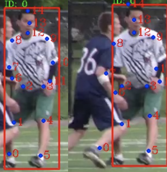
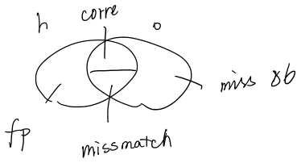

# nise-embedding

My baseline

Task 1. `valid_task_1_DETbox_propfiltered_propthres_0.5_propGT`. This is obtained by not nms the detected box (i.e. use all detected box to estimate joints).

虽然样子上写着 propGT 啥的但是由于是 task1，并没有 prop 这一步，我把它取出来吧，名字改成了

​	`baseline/69.6-noProp-valid_task_1_onlyDETbox_noNMS`

```
& Head & Shou & Elb  & Wri  & Hip  & Knee & Ankl & Total\\
& 79.8 & 78.5 & 70.7 & 59.2 & 70.1 & 65.5 & 58.3 & 69.6 \\
```

Use GT box to estimate。(meaningless)

```
& Head & Shou & Elb  & Wri  & Hip  & Knee & Ankl & Total\\
& 85.8 & 82.3 & 73.8 & 62.6 & 73.4 & 69.5 & 64.5 & 74.0 \\
```


# TODOLIST

+ [ ] 只用有标注的进行 prop（四个连续的 flow 加起来作为整体 flow，比较smooth）。
    + [ ] 因为并不是所有都有标注。如果前一帧没有gt 那就用的是 det 的 box，降低精确度。
+ [x] 确认 det 模型的准确性
+ [x] 确认 esti 的准确性
    + [x] 确定使用ptval 上88的那个模型跑出的结果。
+ [ ] 确认 flow 的有效性
+ [x] 确认 matching 的正确性

# experiment

Single-frame pose estimation training log. 

The person is cropped using gt, and the  accuracy is calculated according to single person.

person detector: [Detectron](https://github.com/roytseng-tw/Detectron.pytorch#supported-network-modules), config `my_e2e_mask_rcnn_X-101-64x4d-FPN_1x`, which has the highest boxes AP in the general fasterRCNN/Mask RCNN family. The modification is only to turn off mask. 

```
$ diff my_e2e_mask_rcnn_X-101-64x4d-FPN_1x.yaml ../Detectron.pytorch/tron_configs/baselines/e2e_mask_rcnn_X-101-64x4d-FPN_1x.yaml
5c5
<   MASK_ON: False # turn off mask
---
>   MASK_ON: True
```


nise-yaml 里 task 的作用

| task | description                                     |
| ---- | ----------------------------------------------- |
| 1    | single frame                                    |
| -1   | flow， 暂时不用                                 |
| -2   | tracking                                        |
| -3   | 生成tracking看删除 gt 与 det 匹配之外的 fp 结果 |


## 2019-04-08

### debug

新生成的 box 和 joint 组合明显有问题

```
(Pdb) p self.unified_boxes[i] 
tensor([  927.9857,   265.1651,  1023.2566,   513.4333,     0.9987])
(Pdb) p self.joints[i]
tensor([[ 145.2113,  513.1005],
        [ 117.9475,  469.4784],
        [ 117.9475,  409.4980],
        [ 134.3058,  412.2243],
        [ 120.6739,  472.2048],
        [ 134.3058,  529.4588],
        [ 107.0419,  406.7716],
        [ 131.5794,  365.8758],
        [ 112.4947,  322.2537],
        [ 126.1266,  324.9801],
        [ 139.7585,  365.8758],
        [ 123.4002,  406.7716],
        [ 112.4947,  314.0745],
        [  96.1364,  297.7162],
        [  98.8628,  275.9052]])
```

900+的怎么会有145的 joint 坐标，所以需要重新检查生成的代码。

啊，unify_box 的时候会将 box 按照 score 从大到小排。prToGT(配对结果索引)是`prToGT[i]`包含的是第 i 个gt 对应的 pred 的位置。所以就算配对之前的 predbox 是排好的，但是直接按照prToGT 会打乱，sort 一下就好了。


## 2019-04-04

yaml 的意义

t-1-matched_detbox，使用某 task1的结果，和 gt 的 annotation 进行match，生成用于 eval 的 json 文件，也就是上面的-3。

t-3-matched_detbox，本质和 t-3root 一样，但是使用的是t-1-matched_detbox出来的 uni_box。

## 2019-04-03

新 code + sb88

```
make eval-t1-sb-88
# gt frames  : 2607 # pred frames: 2607
& Head & Shou & Elb  & Wri  & Hip  & Knee & Ankl & Total\\
& 85.8 & 86.7 & 80.8 & 73.0 & 79.3 & 76.7 & 67.2 & 79.0 \\
```

需要换一种减少fp 的方法，不用 thres 滤掉


## 2019-04-02

- [x] 一步一步检测HRnet 在 posetrack 的错误。


### posetrack task 1 visualize

使用sb88和 hr904对比

#### 做了什么

如题

#### 结果

左图是 sb88，右图是 hr 904，对于 detection box 来说，确实hr904的 val 结果要差点。



那是不是 gtbox 就差不多了呢？发现并不是， gt 一样差很多。


## 2019-04-01

- [x] 使用 make 管理项目


### hrnet debug 中

hrnet三个视频 run 了260s。simple相比之下用了**63.260 s.**

所有视频 HRnet 跑了，**2085.147**，也差不多？

+ [x] 可能是 pt17 的 eval 函数问
+ [x] train 有问题
+ [x] get-db 有问题
    + [x] 应该就是这个了，训练的时候 vis 出来的图片里，RGB 是反着的。
    + [x] 结果也不是
+ [ ] pt-est 的代码问题
    + [ ] DONE，就是你了。

所以结果还是应该将作者的代码run一遍，然后看看里面这些变量具体是什么，然后全部复制过来不要扔掉一些东西。如果要扔掉，一定要确定这个东西真的没用。

代码问题是作者还有一个对图片 normalize 的 transform，之前我都忽略了。

```python
if self.transform:
	input = self.transform(input)
```


## 2019-3-17

### GT joints 和 DET joints的ablation study，以及和gt box 的横向对比

在 weekly report 里。


## 2019-3-15

为了确定是不是`更好的est影响比更好的matching和box更大`，需要怎么做？

如果运行的时候卡住，很有可能就是哪里报错了，但是多线程不会跳出来。

88的结果

```
& Head & Shou & Elb  & Wri  & Hip  & Knee & Ankl & Total\\
& 93.4 & 93.4 & 93.7 & 92.5 & 92.3 & 91.9 & 90.1 & 92.5 \\
```

90的结果

```
& Head & Shou & Elb  & Wri  & Hip  & Knee & Ankl & Total\\
& 93.5 & 93.5 & 93.8 & 92.8 & 92.4 & 92.0 & 90.2 & 92.7 \\
```

## 2019-03-13

训练了res152在 pt17，最终PCKh为90.04 ，但是 MOTA 还是很低。

single-frame+detbox的结果

```
& Head & Shou & Elb  & Wri  & Hip  & Knee & Ankl & Total\\
& 85.5 & 83.9 & 78.1 & 69.2 & 73.7 & 71.8 & 65.6 & 76.1 \\
```

gtbox的结果

```
& Head & Shou & Elb  & Wri  & Hip  & Knee & Ankl & Total\\
& 88.2 & 85.9 & 80.0 & 71.2 & 77.1 & 75.8 & 72.6 & 79.3 \\
```

### res152 on tracking

下面是MOTA最高的结果。

**MOTA**

```
& MOTA & MOTA & MOTA & MOTA & MOTA & MOTA & MOTA & MOTA & MOTP & Prec & Rec  \\
& Head & Shou & Elb  & Wri  & Hip  & Knee & Ankl & Total& Total& Total& Total\\
& 68.6 & 67.5 & 57.6 & 49.6 & 56.3 & 55.0 & 45.1 & 57.9 & 85.2 & 86.1 & 71.7 \\
```

**mAP**

```
& Head & Shou & Elb  & Wri  & Hip  & Knee & Ankl & Total\\
& 78.8 & 76.7 & 70.6 & 60.0 & 66.0 & 63.9 & 57.4 & 68.4 \\
```

### 88vs90 on det box

下面表格的数据都是调参（box-joint threshold）结束后效果最好的，都是`box_0.80_joint_0.50`。

|               | 88.01 | 90.04 | R-FCN | FPN-DCN |
| ------------- | ----- | ----- | ----- | ------- |
| single mAP    | 72.9  | 76.2  |       |         |
| tracking mAP  | 62.0  | 68.4  | 66.0  | 69.3    |
| tracking MOTA | 53.8  | 57.9  | 57.6  | 59.8    |
|               |       |       |       |         |
|               |       |       |       |         |

说明est的提升对最后mAP、MOTA的提升巨大（+1.4/4.1）。

和作者的结果对比的话，基本符合est的mAP越高、mota越高的规律。但是从涨幅来看，从R-FCN到90.04，mAP+2.4，但是MOTA+0.3；从90.04到FPN-DCN，mAP+0.9，MOTA+1.9；从R-FCN到FPN-DCN，mAP+3.3，MOTA+2.2。没有那么线性，是不是说明我的tracking还有不足。但est也只有一个mAP进行比较，细节不足。

### 使用gtbox,90//88的est模型跑task3的结果

目的是想确定如果有更好的box会不会有更好的结果。

88

```
& MOTA & MOTA & MOTA & MOTA & MOTA & MOTA & MOTA & MOTA & MOTP & Prec & Rec  \\
& Head & Shou & Elb  & Wri  & Hip  & Knee & Ankl & Total& Total& Total& Total\\
& 70.4 & 65.8 & 52.2 & 41.0 & 52.4 & 48.6 & 42.1 & 54.4 & 84.2 & 87.8 & 68.0 \\
 
& Head & Shou & Elb  & Wri  & Hip  & Knee & Ankl & Total\\
& 79.4 & 74.6 & 65.6 & 51.0 & 62.2 & 58.7 & 52.7 & 64.5 \\
```

90

```
& MOTA & MOTA & MOTA & MOTA & MOTA & MOTA & MOTA & MOTA & MOTP & Prec & Rec  \\
& Head & Shou & Elb  & Wri  & Hip  & Knee & Ankl & Total& Total& Total& Total\\
& 72.4 & 69.7 & 56.5 & 47.5 & 57.2 & 54.5 & 47.6 & 58.9 & 84.9 & 86.5 & 75.3 \\
 
& Head & Shou & Elb  & Wri  & Hip  & Knee & Ankl & Total\\
& 82.8 & 79.5 & 72.7 & 61.6 & 69.4 & 67.4 & 62.8 & 71.7 \\
```

### 使用gtbox+gt joints的结果

```
& MOTA & MOTA & MOTA & MOTA & MOTA & MOTA & MOTA & MOTA & MOTP & Prec & Rec  \\
& Head & Shou & Elb  & Wri  & Hip  & Knee & Ankl & Total& Total& Total& Total\\
& 87.8 & 88.5 & 89.4 & 89.5 & 89.0 & 88.8 & 88.7 & 88.8 & 96.8 & 99.9 & 96.7 \\

& Head & Shou & Elb  & Wri  & Hip  & Knee & Ankl & Total\\
& 95.5 & 96.7 & 97.1 & 97.0 & 96.9 & 97.0 & 96.8 & 96.6 \\
```

使用的box score和joint score都是1，MOTA 88.8，mAP96.6 。为什么不是100？

另外，MOTA的分段结果是

| num_misses | num_switches | num_false_positives |
| ---------- | ------------ | ------------------- |
| 6996       | 16546        | 134                 |

为什么会有miss？为什么会有FP？明明是用的GTbox和joint。是在eval里匹配人匹配错了吗？

## 2019-3-12

### joint score相关

原本的joint score=joint x box，现在试试只有joint score的。使用nms后的detection结果做实验，从71.5下降到了69.4。

```
& Head & Shou & Elb  & Wri  & Hip  & Knee & Ankl & Total\\
& 79.7 & 78.7 & 70.7 & 59.1 & 69.7 & 65.3 & 57.6 & 69.4 \\
```


### fliptest相关

在single person est里，我关掉了pt17的fliptest，结果是

| Arch | Head   | Shoulder | Elbow  | Wrist  | Hip    | Knee   | Ankle  | Mean   | Mean@0.1 |
| ---- | ------ | -------- | ------ | ------ | ------ | ------ | ------ | ------ | -------- |
|      | 93.151 | 92.323 | 87.225 | 80.956 | 87.258 | 83.405 | 79.046 | 87.289 | 30.362 |

88.013-87.289=0.724，区别也不是很大。

总之在pt上试试，首先是gtbox+88的estimator，有了1.4的提高

```
& Head & Shou & Elb  & Wri  & Hip  & Knee & Ankl & Total\\
& 86.5 & 83.9 & 75.7 & 64.7 & 75.1 & 71.3 & 65.8 & 75.5 \\
```

然后是nms之后的detection，有了1.4的提高，但还是差很多。。。

```
& Head & Shou & Elb  & Wri  & Hip  & Knee & Ankl & Total\\
& 84.2 & 82.4 & 74.3 & 62.9 & 72.8 & 68.2 & 60.0 & 72.9 \\
```

**WAIT**。突然意识到下面的77.15应是使用 Resnet152的结果，而我用的是 res50。从论文的 table5来看，50和152的差别确实就是3.6-4.5，所以……？然而他的 mAP 和 MOTA 组合还是比我高不少。

## 2019-03-10

突然想到 baseline 也在 posetrack 的 leaderboard 上有 task1 的结果

| No.  | Entry                                                        | Additional Training Data | wrists AP | ankles AP | total AP |
| ---- | ------------------------------------------------------------ | ------------------------ | --------- | --------- | -------- |
| 1    | [FlowTrackS](https://posetrack.net/users/view_entry_details.php?entry=FlowTrackS_chl2) | + COCO                   | 74.16     | 66.36     | 77.15    |

不过这个是 test 上的结果，那 val 上应该更高——我现在只有69.6，用 gtbox 也是74，说明 estimation 确实是有问题的。

无论怎么样都要 load human det?因为我代码里写的是只要没有 detection 结果就去重新 detect 一次。现在改了逻辑， detect 没有结果那就是没有，不需要再重复 det，于是也就不需要 load 了。

### 使用88的结果

使用0.35（一开始筛掉的）和0.5（判定两个box是同一个）的nms threshold

```
& Head & Shou & Elb  & Wri  & Hip  & Knee & Ankl & Total\\
& 83.1 & 80.9 & 72.7 & 61.0 & 71.3 & 66.6 & 58.9 & 71.5 \\
```

没有nms的结果，比之前的全面低下。

```
& Head & Shou & Elb  & Wri  & Hip  & Knee & Ankl & Total\\
& 79.9 & 78.4 & 70.4 & 59.0 & 69.7 & 65.1 & 57.7 & 69.3 \\
```

比87.92的下降了几个点。

使用gtbox的结果差不多，提高了0.1

```
& Head & Shou & Elb  & Wri  & Hip  & Knee & Ankl & Total\\
& 85.7 & 82.7 & 74.3 & 62.5 & 73.8 & 69.4 & 64.6 & 74.1 \\
```

### mAP calculation of poseval

1. Use the procedure in [how to find correspondence](#2019-2-28) to match gt people and pred people. Whether joints are matched is calculated here. For each joint type, for each frame, record all existing predicted joints' score and whether they are matched to a gt (i.e. TP or FP). In code they are called `scoreAll` and `labelAll` respectively.
2. For each joint type, 
   1. collect all scores and labels across all frames. Now we have 2 vectors, whose length is the number of all predictions. Also the total number of GT is accumulated across frames.
   2. Calculate pre and rec.
   3. Calculate AP
3. mAP, mPrec, mRec is the mean over all joint types.

Not surprising.

## 2019-3-7

I read the PoseFlow paper, which is the second best now, it has much lower MOTP(67.8 VS simple baseline's 84.5), and MOTA is 58.3 VS 62.9. In my own result, MOTP is always around 82. Maybe this is the break point. MOTP is the average distance between the prediction and gt, so the lower the better.

Nope, I don't think this is important? This is mainly about the precision (by pixel) of estimation, the distance between GT and pred.

### [Solved]New finding

In Paper simple baseline, I find a sentence I didn't notice before

> The ground truth human box is made to a fixed aspect ratio, e.g., height : width = 4 : 3 by extending the box in height or width

i.e. they extend the human bbox. Does this mean after getting the bbox from human joints in PT (by extending the joints), they also rectify the aspect ratio?


> the joint location is predicted on the averaged heatmpaps of the original and flipped image. A quarter offset in the direction from highest response to the second highest response is used to obtain the final location.

They did not use the highest response, but with a little offset, in the COCO estimation.

【Well, these 2 is implemented by the author so this is not the point】

## 2019-03-05

Previously, when training the network on Posetrack, I didn't filtered out those people who only have 1 joint annotated. If a person is annotated with one joint, the training sample has nothing but a meaning less point, resulting in lower accuracy.

I changed the dataset by filtering out those whose area is less than 1000.

87.92->87.97999...., emmm...

After freezing the layers except for the last one and the training for the rest 19 epochs, the mAP is 88. No big improvement.

Then I freeze the previous layers and training this all the time, val mAP = 82.07.

If I want to test the mAP, I can use only the detection result and filter out boxes and joints with lower scores, but don't do the tracking part.

## 2019-2-28

### [solved]Problem

The problem that the numbers don't match still exists.

- [x] After summarizing all the miss/fp/mismatches for `nmsThres_0.35_0.70_box_0.5_joint_0.4`, I found that the numbers don't match.

For example in sequence `020910`, joint 0 has the following data:

| num_misses: | num_switches: | num_false_positives: | num_objects: | num_detections: |
| ----------- | ------------- | -------------------- | ------------ | --------------- |
| 86          | 11            | 18                   | 259          | 173             |



The relationship between parts are sketeched above. `h` is hypothesis/proposal/prediction, `o` is object/ground truth. But the data $173-18+86=241\ne 259​$. The only possible reason is that I didn't draw the Venn diagram correctly.

Anyway, let's look at the code of find correspondence of joints in one frame.      

In code, the relationship is:

1. `match+switch=detection`, this is writen in code

   ```python
   def num_detections(df, num_matches, num_switches):
       """Total number of detected objects including matches and switches."""
       return num_matches + num_switches
   ```

2. `detection+miss=object`

3. `object`: annotated gt

4. `switch`: matched and switched

5. `match`: matched but not switched

6. `fp`:  remaining pred

7. `miss`: remaining gt    

So, my Venn diagram is correct, but my understanding of the output of the evaluation program is wrong. The correct meaning is shown above.

### [solved]How to find correspondence

This is in function `assignGTmulti` of `eval_helpers.py`. Remember that we focus on different types of joints. The procedure is 

1. For each frame, for each joint type, compute the distance between gts and predictions. Distance is `np.linalg.norm(np.subtract(pointGT, pointPr)) / headSize`. There are `num_pred` and `num_gt` preds and gts respectively.
2. `match = dist <= distThresh`.
3. For each frame and person, accumulate how many joints of this person are annotated. For each predicted person, let the score of a (person, gt ) pair be `the number of joints of this person with gt / the number of joints annotated`, i.e. the matching rate.
4. Let the pair (person, gt) with greatest matching rate be matched. But this is just an intermediate result. This  match is only used to filter out gt joints without annotations. Call this `prematch`.
5. The final output of `assignGTmulti` is `motAll`, which is a `dict` containing MOT info for each joint type.
6. Each joint info is a `dict`, with keys
   1. `trackidxGT`/`trackidxPr`: gt/pred joints with anno
   2. `ridxsGT`/`ridxsPr`: actually no use in `computeMetrics`
   3. `dist`: distance between each gt/pred joint pair, corresponding to `trackidxGT` and `Pr`, but not all gt/pred.

This `motAll` is the input of method `computeMetrics`. It utilises `MOTAccumulator` to summarize all events (events = match/miss/fp/switch ...). So take a look at `MOTAccumulator.update`. The input of this method is `oids, hids, dists`, corresponding to `trackidxGT`/`trackidxPr/dist`. Because in `assignGTmulti`, those entries of `dist` not  in `prematch` is set to `nan`, it is quite easy for Munkres algorithm to match the result. So this `prematch` is in fact the final `match`.


### misc

the most time-consuming part of evaluating posetrack is the one using `MOTAccumulator` to accumulate all information.

`metricsMid = mh.compute(accAll[i], metrics = metricsMidNames, return_dataframe = False, name = 'acc')`, will get misses/fp/mm/obj/det data, `len(metricsMid)=5`.

### 2019-02-27

时隔两个月再次开工……

### Something I want to check

- [x] The correctness of matching algorithm。I think this can be check by gt box matching. If gt box is used, the score of each gt box is 1 and of each gt joint is 1. So all gt joints and boxes will all be kept during filtering. As shown in the experiment in 2018-12-27, and the json directory is `pred_json-track-developing/valid_task_-2_GTbox_allBox_tfIoU_nmsThres_0.35_0.70_IoUMetric_mkrs`.

Following experiments aim to keep mAP the same and see what will MOTA be. Since they are only run for task one, no id is assigned. Experiments must be run again with task 3.

- [ ] without joint filtering: Task 3 performance of my baseline for task 1
- [ ] without joint filtering: Task 3 performance of NMSed baseline (thres are 0.35_0.50 respectively)
- [ ] with joint filtering:  T3 of the two mentioned above

Those three to-checks are actually unnecessary. I have conducted experiments about box and joint thres during the process of assigning ID. Only boxes with scores over `box_thres` have ID, and only joint with scores over `joint_thres` are output. This experiment is just a verification of what Detect-and-Track has said, that there is a tradeoff between MOTA and mAP. Filtering boxes and joints results in lower mAP and higher MOTA. We have four associations, box/joint filtering with mAP and MOTA. But as can be seen, filtering boxes doesn't affect mAP too much. 

**CONCLUSION**: The order should be the effect of **<u>joint/MOTA(very big) > joint/mAP > box/MOTA > box/mAP(very small)</u>**.

### What is the problem


**[SOLVED]** The calculation of MOTA in posetracking focuses on each joint type.

1. For one video sequence, for each joint type, accumulate all misses/fp/mm/gt. So there are 15joints*4 sets of data for one seq.
2. For the validation dataset, for each joint type, add up misses/fp/mm/gt in all sequences. In the end we have 15joints*4 sets of data for the whole dataset.
3. For each joint type, calculate MOTA=1-(miss+fp+mm)/gt.
4. MOTA total=average of all joints' MOTA.

The problem of MOTA calculation is solved. Previously I thought total is calculated by combining all joints' misses. But actually MOTA for each joint is calculated seperately and total is the mean.


## 2018-12-27


### 实验

使用gtbox来matching，以及使用gtbox对应gtjoint输出。当然是有filter box和joint的，但是gtbox的score都是1，而且gtjoint的score是可见度，所以不影响。这说明了matching的极限。没有满级的原因是毕竟人还是会有重叠，用box肯定会有错判。

由于使用的是gt，那些没有标注的就跳过了。

```
2018-12-27-gtmatching.txt
& MOTA & MOTA & MOTA & MOTA & MOTA & MOTA & MOTA & MOTA & MOTP & Prec & Rec  \\
& Head & Shou & Elb  & Wri  & Hip  & Knee & Ankl & Total& Total& Total& Total\\
& 91.0 & 91.9 & 92.5 & 92.6 & 92.3 & 92.2 & 92.1 & 92.0 & 96.8 & 99.9 & 98.3 \\
```

进行了调参，结果与2018-12-26实验里2018-12-26-filter box and joint差不了太多。

## 2018-12-26

进入tracking part。论文里有两个 filter， 首先 filter 人，还要把 filtered 人的 joint 滤一遍。

```
We first drop low-confidence detections, which tends to decrease the mAP metric but increase the MOTA tracking metric. 
Also, since the tracking metric MOT penalizes false positives equally regardless of the scores, we drop low confidence joints first to generate the result as in [11]. 
We choose the boxes and joints drop threshold in a data-driven manner on validation set, 0.5 and 0.4 respectively.
```

在 Detect-and-track 里

```
Before linking the detections in time, we drop the low-confidence and potentially incorrect detections.
```

### 目标

- [x] 跑出一个总体的mota 结果，因为我现在做的肯定有问题，所以需要一步一个脚印修正。
  - [ ] 搞清楚mota在joint里怎么算
    - [x] 和mAP不同的是，tracking需要correspondence。detection里，如果两个proposal和gt重合度都>0.3，那么这两个都是tp；其他任何<=0.3的都是fp。这里就允许两个proposal和gt都有correspondence，但是tracking只有一个。
    - [x] [verified] 那我觉得tracking里有两个步骤，一个是correspondence的判定，一个是用threshold判断这个correspondence是不是valid. 
    - [x] evaluateTracking里的`computeMetrics`接受的参数是已经计算好的correspondence，直接计算mota等东西的。
  - [x] 可能是estimation的问题
      - [x] 总体的 mAP 差不多，一般不可能是 est 的问题。
  - [x] 可能是matching问题。
  - [x] 使用 gtbox 作为 matching 的来源，如果正确的话应该能够百分百追踪？
  - [x] 从1744等没有人消失并且人比较容易分辨的来看， matching 没有问题。有的人的标注只有一个关节，那这个就构不成一个 gtbox我会删除，也就没法利用 box 的 iou 进行匹配，所以可能出现 miss；因此在 estimation 的部分也会丢失这几个点。但这不是 matching，而是获取 gt 数据的问题。
  - [x] 可能是输出问题。由于如果输出的格式有问题，那么前面怎么找都不可能正确，所以先看这个。
    - [x] 确定了不是这个问题。
    - [x] 输出人物的顺序不同并不会导致mota的变化。
  - [ ] 可能是 filter 的问题。
- [x] 到底需不需要对那些不连续的帧来 tracking 。中间的部分才有 gt，才能够 matching。应该是要的，因为虽然在 gt 里隔开了，但是 id 还在。
    - [ ] 这个时候就应该出现四帧跳跃估计了？
- [x] 整理 Assign ID 的算法流程。
- [ ] 纠正 greedy matching 的错误。

### 实验

采用nmsthreshold-0.35-0.5，在assignID的时候会以0.5 filter掉人box，并没有filter掉joint。

```

& Head & Shou & Elb  & Wri  & Hip  & Knee & Ankl & Total\\
& 82.7 & 80.8 & 72.8 & 61.1 & 71.4 & 66.8 & 59.2 & 71.5 \\

& MOTA & MOTA & MOTA & MOTA & MOTA & MOTA & MOTA & MOTA & MOTP & Prec & Rec  \\
& Head & Shou & Elb  & Wri  & Hip  & Knee & Ankl & Total& Total& Total& Total\\
& 37.5 & 36.6 &  1.2 &-22.1 & 16.3 & -2.7 &-34.4 &  6.8 & 82.7 & 54.4 & 79.6 \\
```

filter掉了joint

```
2018-12-26-filter box and joint
& Head & Shou & Elb  & Wri  & Hip  & Knee & Ankl & Total\\
& 78.9 & 76.6 & 67.8 & 54.4 & 65.6 & 60.9 & 53.6 & 66.3 \\

& MOTA & MOTA & MOTA & MOTA & MOTA & MOTA & MOTA & MOTA & MOTP & Prec & Rec  \\
& Head & Shou & Elb  & Wri  & Hip  & Knee & Ankl & Total& Total& Total& Total\\
& 63.6 & 62.0 & 48.6 & 38.0 & 53.3 & 48.8 & 38.0 & 51.2 & 83.6 & 80.3 & 71.1 \\
```


只有01001的话

```
& Head & Shou & Elb  & Wri  & Hip  & Knee & Ankl & Total\\
& 99.9 & 98.0 & 94.8 & 89.8 & 98.7 & 95.6 & 96.2 & 96.4 \\

& MOTA & MOTA & MOTA & MOTA & MOTA & MOTA & MOTA & MOTA & MOTP & Prec & Rec  \\
& Head & Shou & Elb  & Wri  & Hip  & Knee & Ankl & Total& Total& Total& Total\\
& 81.0 & 77.5 & 67.7 & 62.8 & 73.9 & 76.3 & 73.8 & 73.8 & 87.0 & 81.0 & 96.9 \\
```

filter掉了joint

```
& Head & Shou & Elb  & Wri  & Hip  & Knee & Ankl & Total\\
& 99.9 & 98.0 & 93.2 & 87.4 & 97.9 & 93.1 & 95.0 & 95.2 \\

& MOTA & MOTA & MOTA & MOTA & MOTA & MOTA & MOTA & MOTA & MOTP & Prec & Rec  \\
& Head & Shou & Elb  & Wri  & Hip  & Knee & Ankl & Total& Total& Total& Total\\
& 96.9 & 93.7 & 84.9 & 79.1 & 94.7 & 88.3 & 90.1 & 90.2 & 87.2 & 94.7 & 95.6 \\
```


## 2018-12-22

### 目标

弄清楚是哪个的作用：nms 还是 flow。需要控制变量，应该先跑一次仅仅使用 detbox 并改变nms 的 thres 的实验。

看起来只是 nms 的作用

### 实验

实验结果：[link](./nms-exp.xlsx)。

- baseline-nonms：不使用 nms，直接用 detection 的 box 来 estimate。
- Detection: 只使用 detection box，加入 nms。

|                | Head | Shou | Elb  | Wri  | Hip  | Knee | Ankl | Total | preds | AP     | delta-baseline | delta-nms |
| -------------- | ---- | ---- | ---- | ---- | ---- | ---- | ---- | ----- | ----- | ------ | -------------- | --------- |
| baseline-nonms | 79.8 | 78.5 | 70.7 | 59.2 | 70.1 | 65.5 | 58.3 | 69.6  |       |        | 0              |           |
| Detection      |      |      |      |      |      |      |      |       |       |        |                |           |
| 0.05_0.30      | 83.4 | 80.8 | 72.7 | 61.3 | 70.4 | 65.7 | 58.1 | 71.2  | 36694 | 0.7264 | 1.6            |           |
| 0.05_0.50      | 80.3 | 79   | 71.1 | 59.6 | 70.5 | 65.8 | 58.5 | 70    | 56920 | 0.7656 | 0.4            |           |
| 0.05_0.70      | 80.3 | 79   | 71.1 | 59.6 | 70.5 | 65.8 | 58.5 | 70    | 56920 | 0.7656 | 0.4            |           |
| 0.15_0.30      | 83.1 | 80.4 | 72.5 | 61.1 | 70   | 65.5 | 58   | 71    | 29745 | 0.7241 | 1.4            |           |
| 0.15_0.50      | 82.1 | 80.5 | 72.4 | 60.6 | 71.5 | 66.8 | 59.3 | 71.2  | 39763 | 0.7647 | 1.6            |           |
| 0.15_0.70      | 82.1 | 80.5 | 72.4 | 60.6 | 71.5 | 66.8 | 59.3 | 71.2  | 39763 | 0.7647 | 1.6            |           |
| 0.25_0.30      | 82.7 | 80.1 | 72.4 | 61   | 69.7 | 65.4 | 57.9 | 70.7  | 26915 | 0.7223 | 1.1            |           |
| 0.25_0.50      | 82.7 | 80.8 | 72.7 | 60.9 | 71.6 | 67   | 59.4 | 71.5  | 33318 | 0.762  | 1.9            |           |
| 0.25_0.70      | 82.7 | 80.8 | 72.7 | 60.9 | 71.6 | 67   | 59.4 | 71.5  | 33318 | 0.762  | 1.9            |           |
| 0.35_0.30      | 82.2 | 79.7 | 72.1 | 60.8 | 69.5 | 65.3 | 57.8 | 70.5  | 24995 | 0.7205 | 0.9            |           |
| 0.35_0.50      | 83   | 80.9 | 72.8 | 61.1 | 71.6 | 66.9 | 59.4 | 71.6  | 29480 | 0.7591 | 2              |           |
| 0.35_0.70      | 83   | 80.9 | 72.8 | 61.1 | 71.6 | 66.9 | 59.4 | 71.6  | 29480 | 0.7591 | 2              |           |
| 0.45_0.30      | 81.9 | 79.4 | 72   | 60.7 | 69.4 | 65.2 | 57.8 | 70.3  | 23476 | 0.7176 | 0.7            |           |
| 0.45_0.50      | 83   | 80.9 | 72.8 | 61.1 | 71.4 | 66.8 | 59.3 | 71.6  | 26763 | 0.7539 | 2              |           |
| 0.45_0.70      | 83   | 80.9 | 72.8 | 61.1 | 71.4 | 66.8 | 59.3 | 71.6  | 26763 | 0.7539 | 2              |           |
|                |      |      |      |      |      |      |      |       |       |        |                |           |
| propGT         |      |      |      |      |      |      |      |       |       |        |                |           |
| 0.05_0.30      | 83.9 | 81.5 | 73.3 | 61.6 | 71.2 | 66.6 | 59.4 | 71.9  | 37415 | 0.7439 | 2.3            | 0.7       |
| 0.05_0.50      | 80.7 | 79.4 | 71.6 | 59.9 | 71.1 | 66.6 | 59.5 | 70.6  | 58440 | 0.7841 | 1              | 0.6       |
| 0.05_0.70      | 74.6 | 74.1 | 67.4 | 56.1 | 66.9 | 63.2 | 56.4 | 66.1  | 65294 | 0.6694 | -3.5           | -3.9      |
| 0.15_0.30      | 83.6 | 81.2 | 73.1 | 61.5 | 70.9 | 66.5 | 59.4 | 71.7  | 30241 | 0.7403 | 2.1            | 0.7       |
| 0.15_0.50      | 82.4 | 80.9 | 72.7 | 60.8 | 72   | 67.4 | 60.3 | 71.7  | 40884 | 0.7847 | 2.1            | 0.5       |
| 0.15_0.70      | 76.3 | 75.6 | 68.6 | 57.1 | 67.8 | 64.1 | 57.2 | 67.3  | 45973 | 0.6785 | -2.3           | -3.9      |
| 0.25_0.30      | 83.3 | 80.9 | 73   | 61.3 | 70.6 | 66.3 | 59.3 | 71.5  | 27323 | 0.7376 | 1.9            | 0.8       |
| 0.25_0.50      | 82.8 | 81.1 | 73   | 61.1 | 72.2 | 67.6 | 60.4 | 71.9  | 34236 | 0.7819 | 2.3            | 0.4       |
| 0.25_0.70      | 76.9 | 76.1 | 69   | 57.4 | 68   | 64.3 | 57.4 | 67.7  | 38455 | 0.6833 | -1.9           | -3.8      |
| 0.35_0.30      | 82.9 | 80.5 | 72.8 | 61.2 | 70.5 | 66.2 | 59.2 | 71.3  | 25335 | 0.7353 | 1.7            | 0.8       |
| 0.35_0.50      | 83.1 | 81.2 | 73.1 | 61.2 | 72.2 | 67.6 | 60.4 | 72    | 30224 | 0.7777 | 2.4            | 0.4       |
| 0.35_0.70      | 77.4 | 76.3 | 69.3 | 57.6 | 68.1 | 64.3 | 57.5 | 67.9  | 33757 | 0.6848 | -1.7           | -3.7      |
| 0.45_0.30      | 82.5 | 80.2 | 72.6 | 61.1 | 70.3 | 66.1 | 59.1 | 71.1  | 23799 | 0.7327 | 1.5            | 0.8       |
| 0.45_0.50      | 83.3 | 81.2 | 73.1 | 61.3 | 72   | 67.5 | 60.3 | 72    | 27390 | 0.7721 | 2.4            | 0.4       |
| 0.45_0.70      | 77.9 | 76.6 | 69.5 | 57.8 | 68.2 | 64.3 | 57.5 | 68.1  | 30301 | 0.6892 | -1.5           | -3.5      |
|                |      |      |      |      |      |      |      |       |       |        |                |           |
| propDET        |      |      |      |      |      |      |      |       |       |        |                |           |
| 0.05_0.30      | 83.6 | 81   | 72.8 | 61.4 | 70.6 | 65.8 | 58.2 | 71.4  | 36694 | 0.7264 | 1.8            | 0.2       |
| 0.05_0.50      | 80   | 78.8 | 71   | 59.4 | 70.4 | 65.7 | 58.5 | 69.8  | 56920 | 0.7656 | 0.2            | -0.2      |
| 0.05_0.70      | 75.3 | 74.8 | 67.8 | 56.4 | 67.6 | 63.4 | 56.2 | 66.5  | 56920 | 0.7656 | -3.1           | -3.5      |
| 0.15_0.30      | 83.3 | 80.7 | 72.6 | 61.2 | 70.2 | 65.6 | 58.2 | 71.1  | 29745 | 0.7241 | 1.5            | 0.1       |
| 0.15_0.50      | 81.9 | 80.3 | 72.3 | 60.5 | 71.5 | 66.7 | 59.3 | 71.1  | 39763 | 0.7647 | 1.5            | -0.1      |
| 0.15_0.70      | 77.4 | 76.5 | 69.2 | 57.6 | 68.6 | 64.5 | 57.1 | 68    | 39763 | 0.7647 | -1.6           | -3.2      |
| 0.25_0.30      | 82.8 | 80.3 | 72.5 | 61.1 | 69.9 | 65.5 | 58.1 | 70.9  | 26915 | 0.7223 | 1.3            | 0.2       |
| 0.25_0.50      | 82.5 | 80.7 | 72.6 | 60.8 | 71.6 | 66.9 | 59.4 | 71.4  | 33318 | 0.762  | 1.8            | -0.1      |
| 0.25_0.70      | 78.3 | 77.1 | 69.7 | 58.1 | 68.9 | 64.8 | 57.3 | 68.5  | 33318 | 0.762  | -1.1           | -3        |
| 0.35_0.30      | 82.4 | 79.8 | 72.3 | 60.9 | 69.7 | 65.4 | 58   | 70.6  | 24995 | 0.7205 | 1              | 0.1       |
| 0.35_0.50      | 82.8 | 80.8 | 72.8 | 60.9 | 71.6 | 66.9 | 59.3 | 71.5  | 29480 | 0.7591 | 1.9            | -0.1      |
| 0.35_0.70      | 79   | 77.7 | 70.1 | 58.4 | 69.1 | 64.9 | 57.3 | 68.8  | 29480 | 0.7591 | -0.8           | -2.8      |
| 0.45_0.30      | 81.9 | 79.5 | 72.1 | 60.8 | 69.5 | 65.3 | 57.9 | 70.4  | 23476 | 0.7176 | 0.8            | 0.1       |
| 0.45_0.50      | 82.9 | 80.7 | 72.7 | 61   | 71.3 | 66.8 | 59.2 | 71.5  | 26763 | 0.7539 | 1.9            | -0.1      |
| 0.45_0.70      | 79.5 | 78   | 70.5 | 58.7 | 69   | 64.8 | 57.3 | 69    | 26763 | 0.7539 | -0.6           | -2.6      |


## 2018-12-21

### 目标

+ [ ] ~~全部的cfg 和logger传入。~~
+ [x] 整理实验数据，选出合适的 nms 参数，并用之于 DETBOX 看效果。
    + [x] 全部都比baseline 还要低。哪里有出问题了？【[Done](Questions.md/#2018-12-21)】
    + [x] 现在看来是输出的问题，输出成了`self.people_ids`个数，实际应该是`unified_box`。判断条件那里没有加`task==-1`，改一下吧。。。
    + [x] 2018-12-21 10:51:17的程序：验证是否输出那里条件判断的问题。
    + [x] 并不是。
+ [x] 有两个选项，一是直接用 unifiedbox作为`run_one_video_flow_debug`的 detect_box，不加 flow 跑。第二个是相当于重新用 flow 算一遍。我不知道第一个能不能兼容多GPU， 因为我多 GPU 的目的是载入足够多的 flow。~~暂时试试第一个。~~重新计算，因为之前的 joint est 有误，所以 box 并不准确。
+ [ ] 试着阅读`tracking_engine_DAT`（应该是 Detect-and-Track，3d mask-rcnn 的那个）。


### 实验结果


## 2018-12-20

- [x] 【昨日】调参代码，用一个py完成。
- [ ] 全部的cfg 和logger 传入。


### 

## 2018-12-19

### 目标

- [x] 调参代码，用一个py完成。

### 实验

使用tensorflow 的 iou， 和 pycocotools 对比，做三个完全相同的实验。

+ [x] 重新跑一次 detect，no nms 的 estimation 结果。

    + [x] 正确，就是我现在的最高点（69.4）

+ [x] 使用土法 nms，得到 box 的 ap

    + [x] 对task 1进行 nms。[根本就没有滤掉好吧，但是 mAP 又有提升]

    ```
    valid_task_1_DETbox_allBox_tfIoU_nmsThres_0.05_0.5
    [INFO] - In total 56920 predictions, 18536 gts.
    [INFO] - AP: tensor(0.7656)
    & Head & Shou & Elb  & Wri  & Hip  & Knee & Ankl & Total\\
    & 80.3 & 79.0 & 71.1 & 59.6 & 70.5 & 65.8 & 58.5 & 70.0 \\
    ```

    + [x] prop 的时候使用重合度高的 gtpose。

    ```
    valid_task_-1_DETbox_allBox_propAll_propGT_tfIoU_nmsThres_0.05_0.5
    [INFO] - In total 58440 predictions, 18536 gts.
    [INFO] - AP: tensor(0.7841)
    Imoko:py oda$  /usr/local/bin/python2.7 /Users/oda/posetrack/poseval/py/evaluate.py --groundTruth=val_gt_task1/ --predictions=valid_task_-1_DETbox_allBox_propAll_propGT_tfIoU_nmsThres_0.05_0.5/ --evalPoseEstimation
    ('# gt frames  :', 2607, '# pred frames:', 2607)
    & Head & Shou & Elb  & Wri  & Hip  & Knee & Ankl & Total\\
    & 80.7 & 79.4 & 71.6 & 59.9 & 71.1 & 66.6 & 59.5 & 70.6 \\
    ```

    + [x] prop 的时候使用人检测和关节检测的结果。

    ```
    valid_task_-1_DETbox_allBox_propAll_propDET_tfIoU_nmsThres_0.05_0.5
    [INFO] - In total 59101 predictions, 18536 gts.
    [INFO] - AP: tensor(0.7662)
    & Head & Shou & Elb  & Wri  & Hip  & Knee & Ankl & Total\\
    & 80.0 & 78.8 & 71.0 & 59.4 & 70.4 & 65.7 & 58.5 & 69.8 \\
    ```


按道理，TensorFlow 版本计算的 iou 是正确的，点应该要比 pycocotools 高。

### 实验

对 nms 的两个 threshold 调参

- `thres_1`: 0.05:0.05:0.5
- `thres_2`: 0.3:0.1:0.9


## 2018-12-18

### baseline

现在nms 的时候使用的iou 全部都是pycocotools.mask.iou，而不是使用 TensorFlow 里面的。这个感觉更不准确，但是更有效。

- [ ] 仅仅使用 people detector 的时候，box 的 AP。【待实验是否这样】

without nms

```
[INFO] - In total 56920 predictions, 18538 gts.
[INFO] - AP: tensor(0.7656)
```

需要 nms。nms 两个 thres 分别是 0.05和0.5 。

```
valid_task_1_DETbox_allBox_propAll_propDET_nmsThres_0.05_0.5
[INFO] - In total 25282 predictions, 18536 gts.
[INFO] - AP: tensor(0.5803)
```

### 实验

现在nms 的时候使用的iou 全部都是pycocotools.mask.iou，而不是使用 TensorFlow 里面的。这个感觉更不准确，但是更有效。

prop 的时候不 filter。注意并不是所有图都有 annotation，所以虽然说是 gtpose， 有一部分仍然是 det pose。

- [ ] 【暂时不做】prop 的时候使用全部 gt 的 pose。

- [x] prop 的时候使用重合度高的 gtpose。

    - [x] score 使用原 box score * gtpose 里关节 visible 的平均值。

    ```
    valid_task_-1_DETbox_allBox_propAll_propGT_nmsThres_0.05_0.5
    [INFO] - In total 23301 predictions, 18536 gts.
    [INFO] - AP: tensor(0.5734)
    ```

- [x] prop 的时候使用人检测和关节检测的结果。

    - [x] score 使用原 box score * 新 joints 的平均值。

    - [ ] ```valid_task_-1_DETbox_allBox_propAll_propDET_nmsThres_0.05_0.5
      [INFO] - In total 23154 predictions, 18536 gts.
      [INFO] - AP: tensor(0.5552)
      ```

~~过滤~~

- [ ] ~~使用重合度高的 gtpose~~
- [ ] ~~prop 的时候使用人检测和关节检测的结果。~~


### 发现bug

posetrack 里，有些人的标记只有一个点。这样的面积就是0，要去掉。

## 2018-12-17

讨论结果

- 做一个控制变量的实验，要做到底

今天要做的事情

- [x] 整理算法详细结果。[link](./current-alg.md).
- [x] 存储flow的结果，以及在detection结果上的estimation数据。用处是flow debug。
- [x] 弄清楚box ap怎么计算。
- [ ] 做实验的时候目的和步骤写清楚，记下来。
- [ ] 保持每天目的记录的习惯，而不是想什么做什么。


### flow debug的流程

==标记有参数的地方==。

- [x] 计算所有 detbox 的 AP。
- [x] 计算 flow，存储。
- [x] prop box（过滤否，==thres==），score。==nms==。
- [x] 记录 nms 结果的 box
- [x] est joints