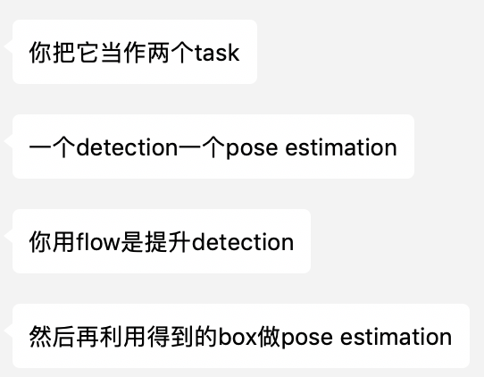
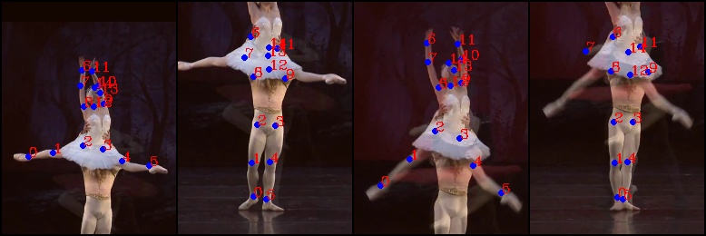
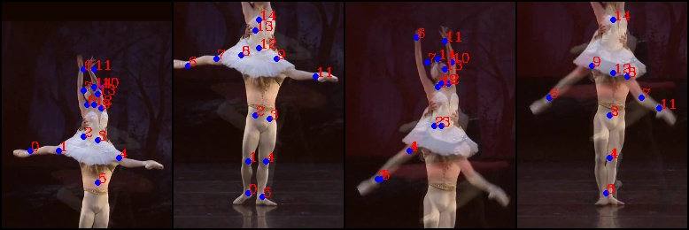

# nise-embedding

Milestones

- 2018-12-06: Surpass the state-of-the-art result of task 1, single frame multi-person pose estimation, in PoseTrack 2017. [link](#2018-12-06).

# TODOLIST

+ [x] 接口问题

+ [x] 固定 gt 的 bbox，est joints（2018-12-03）

+ [ ] ~~找到 single frame 的问题，查看输出的图像。~~

+ [x] 2018-12-06：joint 最终分数=human detection*joint

+ [ ] 训练之前 freeze 一下

+ [x] flow 用 pad 达到 32的倍数

  + [ ] （其他的方式）

+ [ ] joint prop 的 score 怎么确定
+ [ ] 达到pt17的state-of-the-art
+ [ ] 使用data parallel 加速，现在太慢了。
  + [ ] detect可以parallel
  + [ ] flow可以？
  + [ ] 

+ [ ] 达到pt17的state-of-the-art

+ [ ] 使用data parallel 加速，现在太慢了。

  + [ ] 2018-12-11：看了时间之后，发现并没有什么可以减少时间的？可能在 jointprop 和 est的时候整个batch 一起走。

  + [ ] 	Detected 8 boxes
    	人检测…… 1.136 s.
    	生成flow…… 0.121 s.
    	Proped 5 boxes
    	Joint prop…… 0.512 s.
    	Before NMS: 13 people. 	After NMS: 8 people
    	NMS…… 0.000 s.
    	关节预测…… 0.483 s.
    	ID分配…… 0.001 s

  + [ ] detect可以parallel？好像不行。

  + [ ] flow可以？flow 的 model 可以接受 batch 的输入，大小为 $bs\times channels\times 2\times h\times w$。但如果要这一步并行化，就要加载进所有的图片？或者也可以设置一个生成 flow 的 batchsize， 毕竟这个是 root。$2$指的是 flow 需要两张图片，如果要并行就需要$[[1,2],[2,3],[3,4]]$。

+ [x] 宁可花多一点时间去做正确，也不要回头来 debug。

# experiment

Single-frame pose estimation training log. 

The person is cropped using gt, and the  accuracy is calculated according to single person.

person detector: [Detectron](https://github.com/roytseng-tw/Detectron.pytorch#supported-network-modules), config `my_e2e_mask_rcnn_X-101-64x4d-FPN_1x`, which has the highest boxes AP in the general fasterRCNN/Mask RCNN family. The modification is only to turn off mask. 

```
$ diff my_e2e_mask_rcnn_X-101-64x4d-FPN_1x.yaml ../Detectron.pytorch/tron_configs/baselines/e2e_mask_rcnn_X-101-64x4d-FPN_1x.yaml
5c5
<   MASK_ON: False # turn off mask
---
>   MASK_ON: True
```


## 2018-12-11

debug flow 中。

只打印 flow 的box 不够 debug， 还需要什么吗？我想要检测 prop 出来 box 

- [ ] 是否实现正确。打印原来的 joint， 新的 joint，新的 box，如何？
- [ ] 是否能够nms 除去

### 加入了16662的 prop

16662的现象：因为本身人物比较清晰，prop 出来更多的是 false positive。现在想多做实验看是不是 fp 太多的问题，用提高 thres 来减少 prop。

prop 不筛

```
& Head & Shou & Elb  & Wri  & Hip  & Knee & Ankl & Total\\
& 14.2 & 15.8 & 11.7 &  7.6 & 13.4 &  8.3 &  7.2 & 11.4 \\
```

prop 时候用0.5筛掉

```
& Head & Shou & Elb  & Wri  & Hip  & Knee & Ankl & Total\\
& 27.3 & 34.0 & 25.5 & 18.7 & 26.0 & 25.3 & 25.7 & 26.1 \\
```

prop-0.9

```
& Head & Shou & Elb  & Wri  & Hip  & Knee & Ankl & Total\\
& 24.9 & 32.9 & 22.9 & 14.8 & 22.2 & 20.2 & 18.9 & 22.6 \\
```

prop 1-怎么比本身还高了？

```
& Head & Shou & Elb  & Wri  & Hip  & Knee & Ankl & Total\\
& 70.3 & 79.7 & 56.9 & 48.2 & 56.9 & 67.5 & 50.6 & 62.0 \\
```

et1

```
& Head & Shou & Elb  & Wri  & Hip  & Knee & Ankl & Total\\
& 82.3 & 77.3 & 61.6 & 42.6 & 63.6 & 48.4 & 36.4 & 60.5 \\
```

原因找到了：task1用的是`unified_bbox`，而 task2用的是`id_bboxes`，因为`id_bboxes`相当于 filter（以 humanthres） 过后的结果，所以可能 tp 和 fp 都减小了。


现在将 id 改成 unified，因为此时根本不要过滤。

et1（新跑的，怎么又上去了？）但至少和 prop1一样了。

```
& Head & Shou & Elb  & Wri  & Hip  & Knee & Ankl & Total\\
& 69.2 & 82.3 & 60.4 & 51.0 & 61.7 & 76.6 & 52.4 & 65.1 \\
```

prop 1-怎么又比本身还高了？

```
& Head & Shou & Elb  & Wri  & Hip  & Knee & Ankl & Total\\
& 69.2 & 82.3 & 60.4 & 51.0 & 61.7 & 76.6 & 52.4 & 65.1 \\
```

prop-0.9

```
& Head & Shou & Elb  & Wri  & Hip  & Knee & Ankl & Total\\
& 67.9 & 76.7 & 54.3 & 50.3 & 59.5 & 70.2 & 45.3 & 61.1 \\
```

prop 0.5

```
& Head & Shou & Elb  & Wri  & Hip  & Knee & Ankl & Total\\
& 67.2 & 75.8 & 53.7 & 49.6 & 59.2 & 70.6 & 45.6 & 60.7 \\
```

prop 0

```
& Head & Shou & Elb  & Wri  & Hip  & Knee & Ankl & Total\\
& 66.7 & 75.3 & 53.5 & 49.2 & 58.6 & 69.8 & 44.5 & 60.1 \\
```


### 前六个

et1和2018-12-10一样

prop thres=1，和 et1一样。很好。

```
& Head & Shou & Elb  & Wri  & Hip  & Knee & Ankl & Total\\
& 82.3 & 77.3 & 61.6 & 42.6 & 63.6 & 48.4 & 36.4 & 60.5 \\
```

### 全部的

task 1& propthres=1

```
& Head & Shou & Elb  & Wri  & Hip  & Knee & Ankl & Total\\
& 79.8 & 78.5 & 70.7 & 59.2 & 70.1 & 65.5 & 58.3 & 69.6 \\
```


## 2018-12-10

分段进行debug（如果有bug）

- [x] 打印flow的joint和box
- [ ] 我觉得flow出来的box分数不应该直接用原生的。这样的话，如果一个错误的box分数很高，再也没有方法把他去除掉。它就会一直被prop下去。




这个关系到我对过滤的理解。我一开始觉得 detection 和 prop 等价，但实际上还是应该想 prop 只是用来补足 detection 的不足。detection 如果过滤了，fp 和 tp 都可能减少；但是 prop 补足的应该只能是那些概率高的。

【task 1 - 前六】如果 detect 之后立马 filter 并且在 prop 的时候 filter

```
& Head & Shou & Elb  & Wri  & Hip  & Knee & Ankl & Total\\
& 85.3 & 79.8 & 64.0 & 44.6 & 65.3 & 50.1 & 37.8 & 62.6 \\
```

如果只在 detect 时候 filter（task-1）

```
& Head & Shou & Elb  & Wri  & Hip  & Knee & Ankl & Total\\
& 82.3 & 77.3 & 61.6 & 42.6 & 63.6 & 48.4 & 36.4 & 60.5 \\
```

只在prop 的时候过滤

```
& Head & Shou & Elb  & Wri  & Hip  & Knee & Ankl & Total\\
& 82.3 & 77.3 & 61.6 & 42.6 & 63.6 & 48.4 & 36.4 & 60.5 \\
```

如果都不开

```
& Head & Shou & Elb  & Wri  & Hip  & Knee & Ankl & Total\\
& 82.3 & 77.3 & 61.6 & 42.6 & 63.6 & 48.4 & 36.4 & 60.5 \\
```

没用？

而且不是吧为什么就成了60.5，之前还是59.8（在12-6），哪里改了？

## 2018-12-06

Debug：之前 predict joint 的时候有误。从formulation来说应该是
$$
P(Joint,Box|Image)=P(Box|Image)\cdot P(Joint|Box)
$$
而我用的只是$P(Joint|Box)$项，前面没用，所以百分比差了很多（大概是这个原因）。用前六个进行小测试，比[这里](#不使用 gtbox)高了7.7。

```
& Head & Shou & Elb  & Wri  & Hip  & Knee & Ankl & Total\\
& 82.6 & 76.7 & 60.2 & 40.8 & 63.3 & 47.9 & 35.8 & 59.8 \\
```

全部的

```
& Head & Shou & Elb  & Wri  & Hip  & Knee & Ankl & Total\\
& 75.8 & 75.1 & 67.7 & 56.0 & 67.9 & 63.6 & 55.9 & 66.7 \\
```

比论文里高了0.7。


此时的 mota 数据，虽然毫无参考性。

```
& MOTA & MOTA & MOTA & MOTA & MOTA & MOTA & MOTA & MOTA & MOTP & Prec & Rec  \\
& Head & Shou & Elb  & Wri  & Hip  & Knee & Ankl & Total& Total& Total& Total\\
&-108.2 &-100.2 &-164.7 &-191.7 &-128.3 &-160.1 &-214.3 &-149.5 & 83.1 & 26.8 & 83.6 \\
```

### 使用flow的思路

由于flow的model需要宽和高都是64的倍数，之前使用的是resize到一个固定大小，不知道有没有效果。现在改为在右侧和下册pad 0，计算完flow之后只取原图大小的部分。原因在于joint的位置只可能在原图坐标范围内。

现在的bug：joint prop的box会有很多有负数坐标。

```JSON
[-8.7352e+08, -9.2051e+08],
[-4.0187e+08, -9.2051e+08],
[-2.3431e+08,  5.2548e+08],
[-5.8184e+08,  4.2619e+08],
[-8.9214e+08, -8.6465e+08],
[-8.7973e+08, -8.7706e+08],
[-9.0455e+08, -8.5224e+08],
[-9.2317e+08, -9.2051e+08],
[-9.2317e+08, -8.9568e+08],
[-9.2317e+08, -8.9568e+08],
[ 2.6345e+07, -5.5436e+08],
[-9.4799e+08, -9.2051e+08],
[-8.5490e+08, -8.6465e+08],
[-9.2317e+08, -9.2051e+08],
[-1.5983e+08, -7.5295e+08]
```

原因不明，可能是因为flow太奇怪了？

不是，是因为有的box其实prob不高也拿去predict了，挨着边缘而joint预测的结果在圈外，所以joint就会负数，那么prop的时候其实有问题。之前没有意识到这个，因为tensor可以用负数索引。

解决。

## 2018-12-04

### 看gtbox的图

| No.   | phenomenon                                                   | which module's prob? |
| ----- | ------------------------------------------------------------ | -------------------- |
| 05833 | 舞蹈，两个人重合。一个人的joint赋值到了另一个上面            | joint est            |
|       | 镜头渐变的残影                                               | joint est            |
|       | gt
pred
 |                      |
| 14102 | 蹦极，两个人人贴在一起                                       |                      |
|       | 镜头从上往下看，人的透视                                     |                      |
|       | 人太小                                                       |                      |
|       |                                                              |                      |

### 使用detector


## 2018-12-03


参数记录：

### 不使用 gtbox

nms 有两个 thres，1-先 filter 掉低 score 的-0.05，2-两个实例的相似程度-0.3。这是 detectron 的原版参数。

flow网络的 input 参数使用（1024，576）。必须是32的倍数。现在还没用到这个，还在 task1 阶段。


human threshold 改变的实验，使用一小部分的 validation set（前六个）

```
0.9
& Head & Shou & Elb  & Wri  & Hip  & Knee & Ankl & Total\\
& 68.5 & 65.3 & 53.1 & 37.3 & 59.6 & 44.3 & 28.7 & 52.1 \\
0.95
& Head & Shou & Elb  & Wri  & Hip  & Knee & Ankl & Total\\
& 68.5 & 65.3 & 53.1 & 37.3 & 59.6 & 44.3 & 28.7 & 52.1 \
```

使用了更高的准确度的模型
| Arch | Head | Shoulder | Elbow | Wrist | Hip | Knee | Ankle | Mean | Mean@0.1 |
|---|---|---|---|---|---|---|---|---|---|
| 256x192_pose_resnet_50_d256d256d256 | 93.179 | 92.590 | 88.054 | 82.101 | 87.774 | 84.567 | 79.706 | 87.921 | 29.291 |

```
20-87.92
& Head & Shou & Elb  & Wri  & Hip  & Knee & Ankl & Total\\
& 68.1 & 68.6 & 62.0 & 50.8 & 61.9 & 58.9 & 51.3 & 60.8 \\
```


### 使用 gtbox

ablation：不同的准确度的模型

```
经典19
& Head & Shou & Elb  & Wri  & Hip  & Knee & Ankl & Total\\
& 87.6 & 79.6 & 65.0 & 45.6 & 74.8 & 56.9 & 44.9 & 66.4 \\
20-87.92
& Head & Shou & Elb  & Wri  & Hip  & Knee & Ankl & Total\\
& 86.9 & 80.8 & 65.3 & 46.2 & 73.3 & 55.8 & 43.5 & 66.0 \\
```

反而变菜了。试试全部的——变强了0.6%。

```
20-87.92
& Head & Shou & Elb  & Wri  & Hip  & Knee & Ankl & Total\\
& 85.8 & 82.3 & 73.8 & 62.6 & 73.4 & 69.5 & 64.5 & 74.0 \\
```


## 2018-12-01

纠正了 joint 的 score 的问题

```
经典19
# gt frames  : 2607
# pred frames: 2607
Evaluation of per-frame multi-person pose estimation
saving results to ./out/total_AP_metrics.json
Average Precision (AP) metric:
& Head & Shou & Elb  & Wri  & Hip  & Knee & Ankl & Total\\
& 85.5 & 81.8 & 73.6 & 62.1 & 72.9 & 69.1 & 64.5 & 73.6 \\
```

## 2018-11-29

解决2018-11-28的问题，重新计算了 center 和 scale，用gtbbox的话:

```
For task 1
('# gt frames  :', 66558)
('# pred frames:', 66558)
Evaluation of per-frame multi-person pose estimation
('saving results to', './out/total_AP_metrics.json')
Average Precision (AP) metric:
& Head & Shou & Elb  & Wri  & Hip  & Knee & Ankl & Total\\
& 67.8 & 63.4 & 48.2 & 36.0 & 54.8 & 44.2 & 37.1 & 51.4 \\
```

新的问题出现了，就算input的大小、图像和单人关节预测一样，但是结果不一样？

[val_2565_pred](assets/val_2565_pred-1543543057015.jpg)

94-gt


94-pred


multi的时候如下。可以看到predict的0和5重合了，而上面的0是在左脚（虽然说也错了）.


+ [x] detection evaluation
+ [x] pose evaluation(pckh)
+ [x] thres 不同 就是 mean ap 
+ [x] joint 的 score


##    2018-11-28

005067。以下是第一张图对被遮蔽的三人进行est的结果，似乎人的box拉长了就无法est。


对应的single person情况是（以下是gt/predictation成对）


为什么single 要优质一些？是因为box好一些吗？去看box。