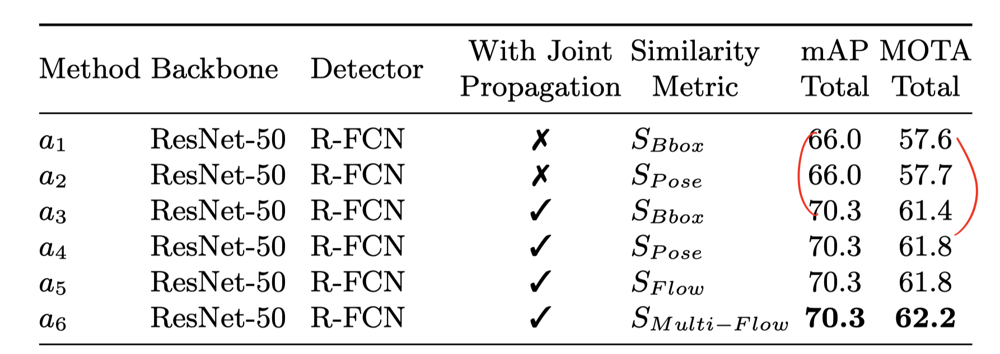

# nise-embedding

# TODOLIST

+ [x] 接口问题
+ [x] 固定 gt 的 bbox，est joints（2018-12-03）
+ [ ] ~~找到 single frame 的问题，查看输出的图像。~~
+ [x] 2018-12-06：joint 最终分数=human detection*joint
+ [ ] 训练之前 freeze 一下
+ [ ] flow 用 pad 达到 32的倍数（其他的方式）
+ [ ] joint prop 的 score 怎么确定

# experiment

Single-frame pose estimation training log. 

The person is cropped using gt, and the  accuracy is calculated according to single person.

person detector: [Detectron](https://github.com/roytseng-tw/Detectron.pytorch#supported-network-modules), config `my_e2e_mask_rcnn_X-101-64x4d-FPN_1x`, which has the highest boxes AP in the general fasterRCNN/Mask RCNN family. The modification is only to turn off mask. 

```
$ diff my_e2e_mask_rcnn_X-101-64x4d-FPN_1x.yaml ../Detectron.pytorch/tron_configs/baselines/e2e_mask_rcnn_X-101-64x4d-FPN_1x.yaml
5c5
<   MASK_ON: False # turn off mask
---
>   MASK_ON: True
```


Using Model from epoch 19, use it on pt17 validation for PT task 2 & 3 (multi-frame pose est)

```
& Head & Shou & Elb  & Wri  & Hip  & Knee & Ankl & Total\\
& 12.6 & 11.8 &  7.1 &  4.1 &  7.7 &  3.8 &  1.8 &  7.4 \\
```


## 2018-12-06

Debug：之前 predict joint 的时候有误。从formulation来说应该是
$$
P(Joint,Box|Image)=P(Box|Image)\cdot P(Joint|Box)
$$
而我用的只是P(Joint|Box)项，前面没用，所以百分比差了很多（大概是这个原因）。用前六个进行小测试，比[这里](#不使用 gtbox)高了7.7。

```
& Head & Shou & Elb  & Wri  & Hip  & Knee & Ankl & Total\\
& 82.6 & 76.7 & 60.2 & 40.8 & 63.3 & 47.9 & 35.8 & 59.8 \\
```

全部的

```
& Head & Shou & Elb  & Wri  & Hip  & Knee & Ankl & Total\\
& 75.8 & 75.1 & 67.7 & 56.0 & 67.9 & 63.6 & 55.9 & 66.7 \\
```

比论文里高了0.7。




## 2018-12-04

### 看gtbox的图

| No.   | phenomenon                                                   | which module's prob? |
| ----- | ------------------------------------------------------------ | -------------------- |
| 05833 | 舞蹈，两个人重合。一个人的joint赋值到了另一个上面            | joint est            |
|       | 镜头渐变的残影                                               | joint est            |
|       | gt
pred
 |                      |
| 14102 | 蹦极，两个人人贴在一起                                       |                      |
|       | 镜头从上往下看，人的透视                                     |                      |
|       | 人太小                                                       |                      |
|       |                                                              |                      |

### 使用detector


## 2018-12-03


参数记录：

### 不使用 gtbox

nms 有两个 thres，1-先 filter 掉低 score 的-0.05，2-两个实例的相似程度-0.3。这是 detectron 的原版参数。

flow网络的 input 参数使用（1024，576）。必须是32的倍数。现在还没用到这个，还在 task1 阶段。


human threshold 改变的实验，使用一小部分的 validation set（前六个）

```
0.9
& Head & Shou & Elb  & Wri  & Hip  & Knee & Ankl & Total\\
& 68.5 & 65.3 & 53.1 & 37.3 & 59.6 & 44.3 & 28.7 & 52.1 \\
0.95
& Head & Shou & Elb  & Wri  & Hip  & Knee & Ankl & Total\\
& 68.5 & 65.3 & 53.1 & 37.3 & 59.6 & 44.3 & 28.7 & 52.1 \
```

使用了更高的准确度的模型
| Arch | Head | Shoulder | Elbow | Wrist | Hip | Knee | Ankle | Mean | Mean@0.1 |
|---|---|---|---|---|---|---|---|---|---|
| 256x192_pose_resnet_50_d256d256d256 | 93.179 | 92.590 | 88.054 | 82.101 | 87.774 | 84.567 | 79.706 | 87.921 | 29.291 |

```
20-87.92
& Head & Shou & Elb  & Wri  & Hip  & Knee & Ankl & Total\\
& 68.1 & 68.6 & 62.0 & 50.8 & 61.9 & 58.9 & 51.3 & 60.8 \\
```


### 使用 gtbox

ablation：不同的准确度的模型

```
经典19
& Head & Shou & Elb  & Wri  & Hip  & Knee & Ankl & Total\\
& 87.6 & 79.6 & 65.0 & 45.6 & 74.8 & 56.9 & 44.9 & 66.4 \\
20-87.92
& Head & Shou & Elb  & Wri  & Hip  & Knee & Ankl & Total\\
& 86.9 & 80.8 & 65.3 & 46.2 & 73.3 & 55.8 & 43.5 & 66.0 \\
```

反而变菜了。试试全部的——变强了0.6%。

```
20-87.92
& Head & Shou & Elb  & Wri  & Hip  & Knee & Ankl & Total\\
& 85.8 & 82.3 & 73.8 & 62.6 & 73.4 & 69.5 & 64.5 & 74.0 \\
```


## 2018-12-01

纠正了 joint 的 score 的问题

```
经典19
# gt frames  : 2607
# pred frames: 2607
Evaluation of per-frame multi-person pose estimation
saving results to ./out/total_AP_metrics.json
Average Precision (AP) metric:
& Head & Shou & Elb  & Wri  & Hip  & Knee & Ankl & Total\\
& 85.5 & 81.8 & 73.6 & 62.1 & 72.9 & 69.1 & 64.5 & 73.6 \\
```

## 2018-11-29

解决2018-11-28的问题，重新计算了 center 和 scale，用gtbbox的话:

```
For task 1
('# gt frames  :', 66558)
('# pred frames:', 66558)
Evaluation of per-frame multi-person pose estimation
('saving results to', './out/total_AP_metrics.json')
Average Precision (AP) metric:
& Head & Shou & Elb  & Wri  & Hip  & Knee & Ankl & Total\\
& 67.8 & 63.4 & 48.2 & 36.0 & 54.8 & 44.2 & 37.1 & 51.4 \\
```

新的问题出现了，就算input的大小、图像和单人关节预测一样，但是结果不一样？

[val_2565_pred](assets/val_2565_pred-1543543057015.jpg)

94-gt


94-pred


multi的时候如下。可以看到predict的0和5重合了，而上面的0是在左脚（虽然说也错了）.


+ [x] detection evaluation
+ [x] pose evaluation(pckh)
+ [x] thres 不同 就是 mean ap 
+ [x] joint 的 score


##    2018-11-28

005067。以下是第一张图对被遮蔽的三人进行est的结果，似乎人的box拉长了就无法est。


对应的single person情况是（以下是gt/predictation成对）


为什么single 要优质一些？是因为box好一些吗？去看box。